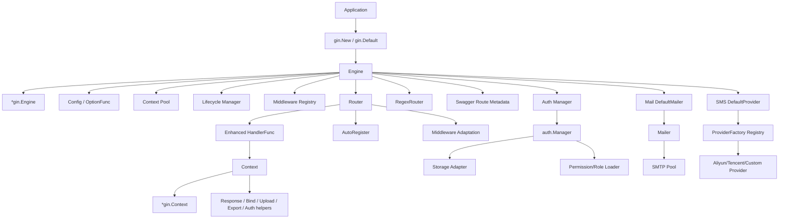
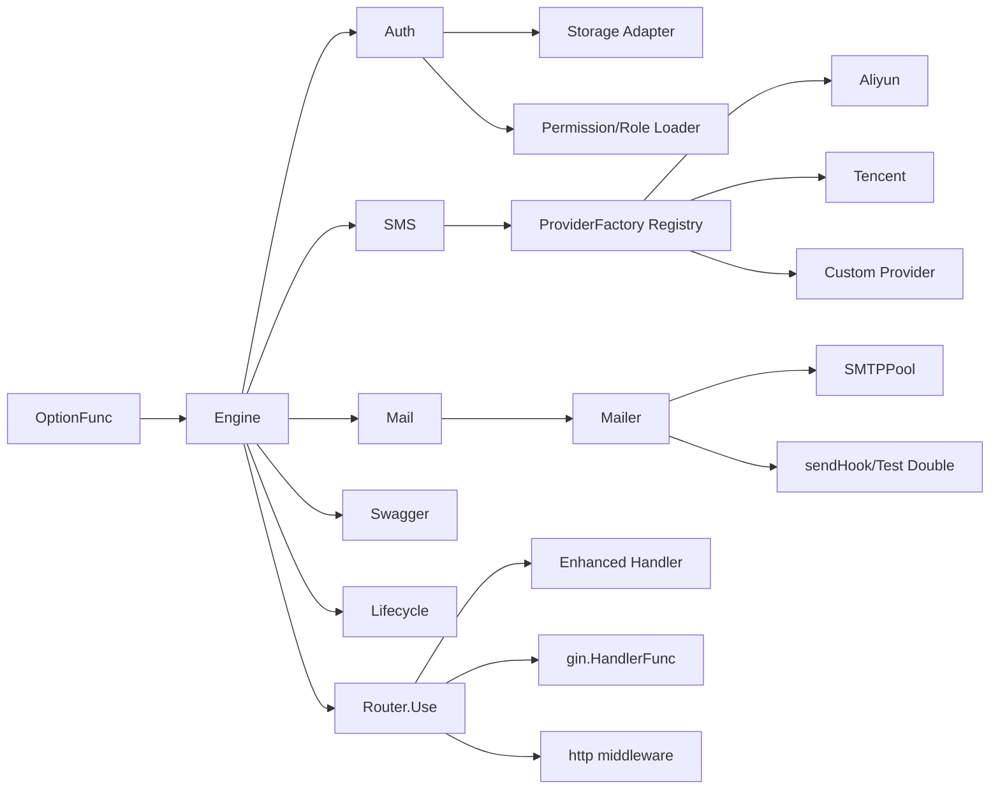
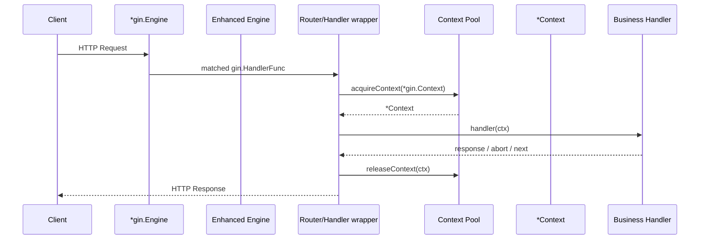
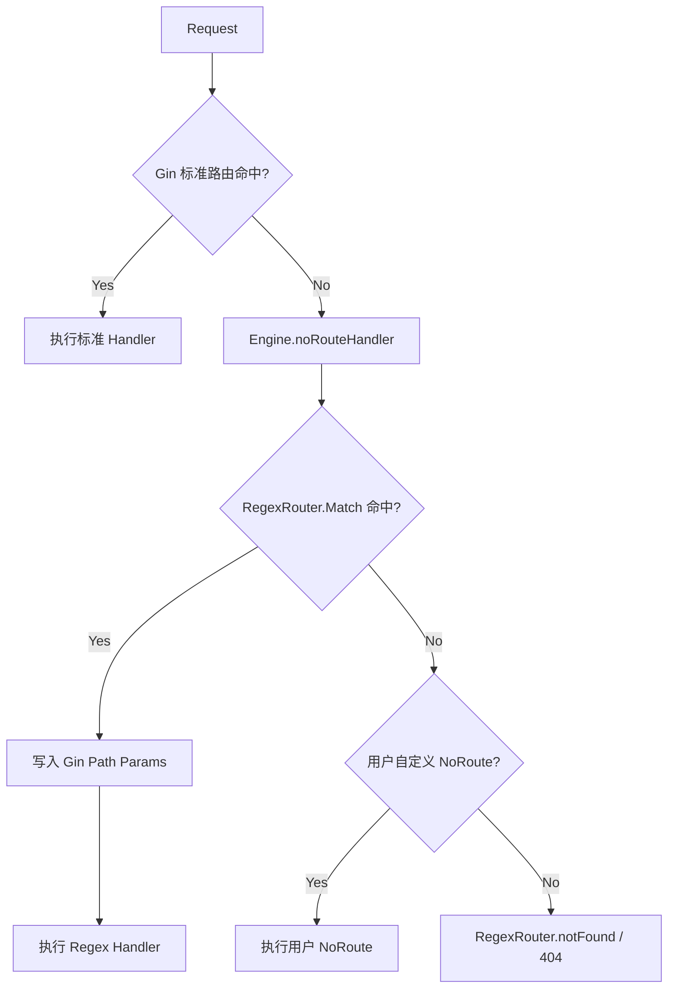
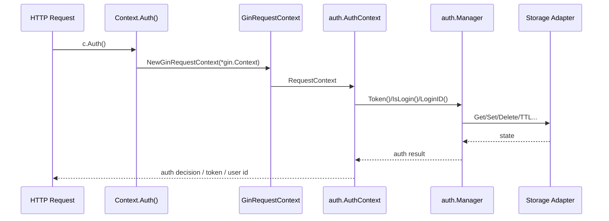

# DESIGN.md

## 模块概览

根模块 `github.com/darkit/gin` 的设计目标不是重写 Gin，而是在 **保持 Gin 路由与执行模型不变** 的前提下，叠加一层可组合的增强能力：增强 `Context`、统一配置入口、可扩展认证与 Provider 子系统、Regex 路由补充、生命周期管理，以及一组围绕生产环境的工具能力。

从代码形态看，该模块的核心不是“新框架替换旧框架”，而是 **以组合（composition）包装 `*gin.Engine`，再通过适配器和池化把增强能力压入请求路径**。关键入口见 `engine.go:29-47`、`engine.go:50-76`、`router.go:20-24`、`context.go:22-26`。

---

## 设计目标（Goals）

1. **兼容优先**
   - 保留 Gin 的原生 `Engine` / `RouterGroup` / `gin.HandlerFunc` 生态。
   - 允许增量迁移，而非强制整体替换。
   - 体现于 `Engine` 嵌入 `*gin.Engine` 的设计（`engine.go:29-47`）。

2. **渐进增强**
   - 在不破坏原生调用方式的前提下提供增强 `Context`、自动注册、Regex 路由、Swagger、Auth、上传、导出等能力。
   - 体现于 `Context` 包装和 `Router` 包装（`context.go:22-26`，`router.go:20-24`）。

3. **低额外开销**
   - 通过对象池、方法索引、缓存与连接池降低增强层成本。
   - 体现于 `Engine.contextPool`、`RegexRouter.paramsPool`、`routeCache`、`SMTPPool`（`engine.go:46`, `engine.go:64-68`, `regex_router.go:36`, `regex_router.go:50-55`, `auto_register.go:77-89`, `pkg/mail/mailer.go:48-84`）。

4. **可插拔扩展**
   - 允许外部实现存储、短信 Provider、权限加载器、生命周期 Hook、中间件。
   - 体现于 `auth` 存储接口、`sms.ProviderFactory`、`middleware.Registry`、`lifecycle.Manager`（`auth/core/adapter/storage.go:5-42`, `pkg/sms/sms.go:66-73`, `middleware/registry.go:20-108`, `pkg/lifecycle/manager.go:29-80`）。

5. **面向生产的安全与运行治理**
   - 在配置阶段尽早失败，在运行阶段返回可判定错误，并支持优雅停机。
   - 体现于 `WithAuth`/`WithSMS`/`WithMail` 校验与初始化、`lifecycle.Manager` 的 `Run`/`Shutdown`（`options.go:129-191`, `pkg/lifecycle/manager.go:82-177`）。

---

## 非目标（Non-Goals）

1. **不替代 Gin 内核**
   - 不实现新的 HTTP server 或新的路由主引擎。
   - 标准路由仍由 Gin 负责，Regex 路由仅作为 `NoRoute` fallback（`engine.go:226-263`, `engine.go:370-398`）。

2. **不统一抽象所有外部子系统为同一种插件协议**
   - SMS 采用显式 `ProviderFactory` 注册表。
   - Mail 当前是 `Mailer` + option + 连接池模型，不是命名 Provider 注册表（`pkg/sms/sms.go:66-107`, `pkg/mail/config.go:13-44`, `pkg/mail/mailer.go:297-330`）。

3. **不内建业务模型与持久化策略**
   - Auth 不负责用户表、角色表、权限表建模。
   - 默认内存存储只服务开发/单进程场景，生产持久化交由适配器实现（`auth/config.go:105-120`, `auth/export.go:133-166`）。

4. **不中断用户已有 Gin 中间件与 Handler 生态**
   - 扩展重点是“适配”而非“改写”。
   - `Router.Use` 明确兼容增强 Handler、原生 Gin middleware、标准 `http.Handler` middleware（`router.go:241-300`）。

---

## 架构总览

### 组件关系图



### 分层说明

| 层                  | 职责                                                    | 关键代码                                                               |
| ------------------- | ------------------------------------------------------- | ---------------------------------------------------------------------- |
| Compatibility Layer | 保留 Gin API 模型，避免迁移断裂                         | `engine.go:29-47`, `gin_compat.go`                                     |
| Enhancement Layer   | 提供增强 `Context`、`Router`、自动注册、Regex 路由      | `context.go`, `router.go`, `auto_register.go`, `regex_router.go`       |
| Extension Layer     | 挂接 Auth、SMS、Mail、Swagger、Lifecycle                | `options.go:129-191`, `pkg/*`                                          |
| Adaptation Layer    | 把 Gin / HTTP / Storage / RequestContext 接到统一调用面 | `router.go:241-300`, `auth/adapter.go`, `auth/core/adapter/storage.go` |

---

## 核心设计决策与权衡

### 1. Engine 使用组合而非继承

`Engine` 直接嵌入 `*gin.Engine`，同时组合配置、日志、缓存、生命周期、Auth、RegexRouter、Context 池等协作者（`engine.go:29-47`）。

**理由**

- Go 没有传统继承；嵌入 `*gin.Engine` 是最自然的复用方式。
- 用户仍可直接调用原生 Gin 方法，例如 `Use`、`NoMethod`、`Static`。
- 新能力以字段形式挂载，避免污染 Gin 内部结构。

**权衡**

- 优点：兼容性极强，迁移成本极低。
- 代价：增强能力分散在包装层与被嵌入对象之间，文档必须明确“哪些能力来自 Gin，哪些来自增强层”。

### 2. Context 采用请求期包装 + 跨请求池化

`Context` 只是 `*gin.Context` + `engine *Engine` 的轻包装（`context.go:22-26`）；请求进入时由 `Engine.acquireContext` 从 `sync.Pool` 获取，请求结束后释放（`engine.go:79-92`，`router.go:47-66`）。

**理由**

- 避免每次路由执行都重新分配增强 `Context`。
- 增强方法仍然建立在 Gin 的原始 request/response 生命周期之上。

**权衡**

- 优点：请求路径额外对象分配极低。
- 代价：池化对象必须严格重置；当前只重置 `Context` 与 `engine` 指针，依赖 Gin 为每个请求提供新的 `gin.Context`（`engine.go:83-85`）。这要求增强 `Context` 不缓存跨请求状态。

### 3. 标准路由保持 Gin 主导，RegexRouter 仅作 fallback

`RegexRouter` 不替换 Gin 的匹配流程，而是通过统一 `NoRoute` 入口在标准路由未命中时再匹配 Regex 路由（`engine.go:265-293`, `engine.go:370-398`）。

**理由**

- 保留 Gin 的性能和成熟行为作为主路径。
- 仅在 Gin 不支持的 Chi 风格 Regex 场景下引入补充能力。

**权衡**

- 优点：最大限度复用 Gin 现有行为。
- 代价：Regex 路由优先级天然低于标准路由；它不是第一层路由树，而是 fallback 路由器。

### 4. Middleware 采用“运行时适配”而非统一重写

`Router.Use` 接受多种 middleware 形态：增强 `HandlerFunc`、`func(*Context)`、原生 `gin.HandlerFunc`、`func(*gin.Context)`、Chi/标准 `func(http.Handler) http.Handler`（`router.go:274-300`）。其中 `adaptHTTPMiddleware` 负责标准 HTTP middleware 与 Gin 链的桥接（`router.go:241-272`）。

**理由**

- 让外部现有 middleware 能直接接入，无需迁移成本。
- 对 Chi 风格 middleware，框架跟踪 `next.ServeHTTP` 是否被调用，以及响应是否已写出，从而避免重复写入（`router.go:243-270`）。

**权衡**

- 优点：生态兼容面广。
- 代价：适配逻辑复杂于纯 Gin middleware；用户若传入“提前写响应但仍继续 next”的不规范 middleware，行为边界需要文档约束。

### 5. Middleware Registry 是注册目录，不是自动装配总线

`Engine` 在创建时初始化 `middleware.Registry`（`engine.go:59-60`），而 `Registry` 支持注册、启停、排序和生成链（`middleware/registry.go:20-108`）。但当前请求主路径仍主要通过 `Engine.Use` / `Router.Use` 显式挂载 middleware，而不是自动从 `Registry` 拉链执行。

**理由**

- 先把“可枚举、可排序、可测试”的 middleware 元数据层稳定下来。
- 不强行把运行时 middleware 装配绑定到同一抽象，保留显式控制。

**权衡**

- 优点：低侵入、易测试。
- 代价：存在两个概念层：
  1. Gin/Router 的真实执行链；
  2. `Registry` 的中间件目录与候选链。

### 6. 配置使用 Functional Options，并在初始化期尽早失败

根模块通过 `OptionFunc func(*Engine)` 进行配置（`options.go:15-17`），各子系统在 `WithXxx` 中直接校验和初始化，如 `WithAuth`、`WithMail`、`WithSMS`（`options.go:129-191`）。

**理由**

- 避免构造函数参数爆炸。
- 保持新增特性时的 API 向后兼容。
- 把配置错误尽量前移到启动阶段。

**权衡**

- 优点：扩展简单、调用清晰。
- 代价：部分 Option 在错误时使用 `panic`（如 `WithTrustedProxies`、`WithMail`、`WithSMS`、`WithAuth`），这将配置错误视为启动期编排错误，而不是运行期可恢复错误。

### 7. Auth 采用 Storage Adapter Pattern

`auth` 对外暴露 `Storage` 接口（实为 `auth/core/adapter.Storage` 别名），并提供 `NewMemoryStorage` / `NewRedisStorage` 工厂；`WithAuth` 在未显式提供 `Storage` 时回退到内存实现（`auth/core/adapter/storage.go:5-42`, `auth/export.go:27-29`, `auth/export.go:133-166`, `options.go:171-190`）。

**理由**

- 认证状态与会话状态天然依赖存储，不应耦合单一后端。
- 让开发环境与生产环境可以切换不同持久化策略。

**权衡**

- 优点：Auth 核心逻辑与存储解耦。
- 代价：存储接口较大，适配器实现成本不低；若选错后端，会直接影响 Token 生命周期与并发登录语义。

### 8. 外部 Provider 模式是“按子域细化”而非统一抽象

- **SMS**：有明确的 `ProviderFactory` 注册表与命名 Provider 机制（`pkg/sms/sms.go:66-107`）。
- **Mail**：当前不是命名 Provider 注册表，而是 `Mailer` + `MailOption` + `SMTPPool` 的可配置发送通道（`pkg/mail/config.go:13-44`, `pkg/mail/mailer.go:297-330`, `pkg/mail/mailer.go:466-521`）。

**理由**

- SMS Provider 差异显著，适合显式工厂注册。
- Mail 当前主要抽象的是 SMTP 发送与连接复用，不是多厂商协议注册表。

**权衡**

- 优点：每个子域使用最贴近问题的抽象。
- 代价：框架层没有“一种插件协议走天下”的一致性，需要在文档中明确不同扩展点的风格差异。

---

## 关键架构模式

### Engine composition over inheritance

```go
type Engine struct {
    *gin.Engine
    config      *Config
    lifecycle   *lifecycle.Manager
    middleware  *middleware.Registry
    authManager *auth.Manager
    regexRouter *RegexRouter
    contextPool sync.Pool
}
```

- 参考：`engine.go:29-47`
- 结论：这是典型 **composition over inheritance**；Gin 负责 HTTP 核心，扩展能力作为协作者注入。

### Context pooling strategy

```go
contextPool: sync.Pool{
    New: func() any { return &Context{} },
}
```

```go
func (e *Engine) acquireContext(c *gin.Context) *Context
func (e *Engine) releaseContext(ctx *Context)
```

- 参考：`engine.go:64-68`, `engine.go:79-92`, `router.go:47-66`
- 结论：增强 `Context` 是轻量 façade，通过池化压低请求期分配。

### Middleware chain adaptation

```go
func adaptHTTPMiddleware(mw func(http.Handler) http.Handler) gin.HandlerFunc
```

- 跟踪 `nextCalled`
- 检查 `c.Writer.Written()`
- 若中间件未调用 `next`，自动 `Abort()`

- 参考：`router.go:241-272`
- 结论：这是 **middleware chain adaptation**，把 HTTP middleware 语义桥接到 Gin 执行模型。

### Provider factory pattern

```go
type ProviderFactory func(cfg SMSConfig) (SMSProvider, error)
var providerFactories = map[string]ProviderFactory{}
func RegisterProvider(name string, factory ProviderFactory)
```

- 参考：`pkg/sms/sms.go:66-73`
- 结论：SMS 子系统是典型 **provider factory pattern**。

### Storage adapter pattern

```go
type Storage interface {
    Set(key string, value any, expiration time.Duration) error
    Get(key string) (any, error)
    Delete(keys ...string) error
    ...
}
```

- 参考：`auth/core/adapter/storage.go:5-42`
- 结论：Auth 通过 **storage adapter pattern** 屏蔽不同后端。

---

## 扩展点与插件架构

### 扩展点清单

| 扩展点                  | 机制                                        | 作用                      | 关键代码                                                                       |
| ----------------------- | ------------------------------------------- | ------------------------- | ------------------------------------------------------------------------------ |
| Engine 配置             | `OptionFunc`                                | 启用/注入子系统           | `options.go:15-191`                                                            |
| Middleware 目录         | `middleware.Registry`                       | 注册、启停、排序中间件    | `middleware/registry.go:20-119`                                                |
| Router middleware       | `Router.Use(...any)`                        | 适配多类型 middleware     | `router.go:274-300`                                                            |
| AutoRegister Regex 覆盖 | `RegexPatternProvider` / `WithRegexPattern` | 自定义自动注册 Regex 路径 | `auto_register.go:17-23`, `auto_register.go:50-59`, `auto_register.go:182-201` |
| Auth 存储               | `auth.Storage`                              | 替换会话/Token 后端       | `auth/core/adapter/storage.go:5-42`                                            |
| Auth 权限/角色加载器    | `PermissionLoader` / `RoleLoader`           | 与业务库对接              | `auth/config.go:112-121`, `auth/export.go:160-163`                             |
| SMS Provider            | `RegisterProvider`                          | 接入自定义短信服务商      | `pkg/sms/sms.go:66-107`                                                        |
| Lifecycle hooks         | `OnStart` / `OnShutdown` / `OnStopped`      | 接入启动/停机治理逻辑     | `pkg/lifecycle/manager.go:61-80`                                               |
| Mail 发送通道           | `Mailer` + `sendHook` + pool options        | 测试替身、连接池控制      | `pkg/mail/mailer.go:300-305`, `pkg/mail/mailer.go:327-330`                     |

### 插件架构图



### 当前插件架构的取舍

- 框架故意不把所有扩展都压成同一接口。
- 这样做牺牲了一部分“统一感”，但换来每个子域更贴近实际问题：
  - Auth 关注状态存储与请求上下文适配。
  - SMS 关注多 Provider 注册。
  - Mail 关注连接复用与批量并发发送。

---

## 数据流设计

### 1. HTTP 请求主路径



**实现对应**

- `Engine.wrapHandlers`：`engine.go:142-153`
- `wrapHandler` / `wrapHandlers`：`router.go:47-66`
- `acquireContext` / `releaseContext`：`engine.go:79-92`

### 2. Regex 路由 fallback 流



**实现对应**

- `RegexRouter()` 初始化与 NoRoute 挂接：`engine.go:255-269`
- 统一 fallback 入口：`engine.go:370-398`
- chi 风格路由树匹配：`regex_tree.go`、`regex_router.go`
- `Engine.Routes()` 与 Swagger 会把 regex 路由合并进统一观测面：`engine.go`

### 3. Auth 请求流



**实现对应**

- `Context.Auth()`：`context_auth.go:25-34`
- Gin 请求适配：`auth/adapter.go:11-166`
- 存储抽象：`auth/core/adapter/storage.go:5-42`
- `WithAuth` 初始化管理器：`options.go:171-190`

### 4. Provider 初始化流（SMS / Mail）

```mermaid
flowchart LR
    A[OptionFunc] --> B{WithSMS / WithMail}
    B --> C[Validate config]
    C --> D1[InitDefaultProvider(SMS)]
    C --> D2[InitDefaultMailer(Mail)]
    D1 --> E1[ProviderFactory -> concrete provider]
    D2 --> E2[Mailer instance]
    E2 --> F2[Optional SMTPPool]
```

**说明**

- `WithSMS`：命名 Provider 工厂注册表（`options.go:139-147`, `pkg/sms/sms.go:76-107`）。
- `WithMail`：默认 Mailer 单例初始化（`options.go:129-137`, `pkg/mail/config.go:13-33`）。

---

## 模块职责拆分

### Engine

负责：

- 聚合核心运行时依赖
- 管理根配置与生命周期
- 持有 RegexRouter/Auth/Swagger 上下文
- 池化增强 `Context`

不负责：

- 替代 Gin 的 HTTP 内核
- 自动编排所有可选中间件

参考：`engine.go:29-47`, `engine.go:50-123`

### Router

负责：

- 将增强 `HandlerFunc` 适配到 Gin
- 按需兼容多种 middleware 类型
- 提供资源路由、自动注册、Swagger 元数据采集

参考：`router.go:17-24`, `router.go:47-66`, `router.go:274-312`, `auto_register.go:119-170`

### Context

负责：

- 在 `gin.Context` 之上提供更高层 helper API
- 聚合参数读取、绑定校验、响应、Auth、上传、导出等能力

参考：`context.go:22-26`, `context.go:57-258`, `context_auth.go:8-34`

### RegexRouter

负责：

- 支持 Chi 风格 `{param:regexp}` 与 `*` 路由
- 仅在标准路由未命中时执行
- 支持分组、中间件继承与参数注入

参考：`regex_router.go:22-40`, `regex_router.go:65-84`, `regex_router.go:263-295`, `regex_router.go:337-461`

### Auth

负责：

- 请求级认证上下文
- Token / Session / 权限 / 角色 / 封禁逻辑
- 可替换存储后端

参考：`auth/config.go`, `auth/auth.go`, `auth/export.go`, `auth/core/adapter/storage.go`

### Middleware Registry

负责：

- 维护一组可启停、可排序的 middleware 定义
- 为统一治理和测试提供目录化模型

参考：`middleware/registry.go:11-119`

### Lifecycle Manager

负责：

- 启动前 Hook
- 信号监听
- 优雅关停与超时控制
- 停机回调

参考：`pkg/lifecycle/manager.go:32-190`

---

## 安全设计考虑

### 1. 启动期配置校验优先

- `AuthConfig.Validate()` 强制 JWT 模式提供 `Secret`，并检查过期时间与 Token 风格合法性（`auth/config.go:234-252`）。
- `WithMail` / `WithSMS` 在初始化默认实例前即执行校验，配置不合法直接失败（`options.go:129-147`）。

**设计意图**

- 把“错误配置上线”视为高危问题，宁可启动失败，也不让系统带病运行。

### 2. 代理链与真实 IP 获取需要配套治理

- `Context.GetIP()` 优先读取 `X-Real-IP` / `X-Forwarded-For`（`context.go:28-40`）。
- 根模块同时提供 `SetTrustedProxies` / `WithTrustedProxies`（`engine.go:353-368`, `options.go:39-46`）。

**设计权衡**

- 便于反向代理部署下获取真实 IP。
- 但若未配置可信代理，任何上游 Header 都可能被伪造；因此文档与部署必须成对出现。

### 3. Auth 存储与 Cookie 行为由显式配置控制

- Cookie 读取是 opt-in（默认 `ReadFromCookie=false`），降低默认 CSRF 暴露面（`auth/config.go:147-172`）。
- Cookie 还可配置 `HttpOnly`、`Secure`、`SameSite`（`auth/config.go:123-145`）。

### 4. 中间件适配防止重复写响应

`adaptHTTPMiddleware` 会检查：

- 进入时 `wasWritten`
- middleware 执行后 `c.Writer.Written()`
- `next.ServeHTTP` 是否被调用

从而避免标准 HTTP middleware 与 Gin 链重复写入响应（`router.go:241-272`）。

### 5. Regex 参数统一走 Gin Path Params

RegexRouter 将捕获参数直接注入 Gin `Params` 与 `Request.SetPathValue`，业务侧统一通过 `c.Param(...)` 读取（`engine.go`, `regex_router.go`）。

### 6. Mail TLS 最低版本受限

SMTP TLS 显式设为 `tls.VersionTLS12`，并关闭 `InsecureSkipVerify`（`pkg/mail/mailer.go:179-184`, `pkg/mail/mailer.go:335-340`）。

### 7. 输入验证采用结构化错误输出

`BindJSONOrAbort` / `BindQueryOrAbort` 会把 `validator` 错误转为结构化 `ValidationError`，然后终止执行链（`context.go:240-258`, `context.go:260-282`）。

---

## 性能设计

### 1. Context 对象池

- `sync.Pool` 复用增强 `Context`（`engine.go:46`, `engine.go:64-68`, `engine.go:79-92`）。
- 适用于高 QPS 下的短生命周期对象。

### 2. RegexRouter chi-style 路由树 + 参数池

- Regex 路由内核使用 chi 风格树结构，按 `static -> regexp -> param -> catch-all` 优先级匹配，而不是整表线性扫描。
- `routesByMethod` 与 `routes` 保留为观测与兼容索引，真实匹配由 `regex_tree.go` 中的树节点负责。
- 参数 `map[string]string` 仍通过 `paramsPool` 复用；对外暴露的 `Match()` 会复制结果后再归还池对象，避免把池内对象泄露给调用方。

**权衡**

- fallback 路由的正确性、优先级语义与 chi 更一致。
- 由于仍挂在 Gin `NoRoute` 之后，它依然是补充层而非第一层主路由引擎。

### 3. AutoRegister 路由元数据缓存

- 控制器方法解析结果缓存于 `routeCache.entries`，避免重复反射扫描（`auto_register.go:77-89`, `auto_register.go:227-248`）。

### 4. Mail 连接池与批量并发发送

- `SMTPPool` 复用 SMTP 连接（`pkg/mail/mailer.go:48-165`）。
- `SendBatch` 支持 `WithMaxConcurrent` 控制并发 worker 数（`pkg/mail/mailer.go:364-464`）。
- 可配置 `WithPoolSize`、`WithPoolMaxIdle`、`WithPoolTimeout`（`pkg/mail/mailer.go:259-278`）。

### 5. 延迟初始化与按需挂载

- `RegexRouter` 懒加载，只在调用 `RegexRouter()` 时初始化（`engine.go:255-263`）。
- Swagger 文档生成在请求到 `/swagger` 或 `/swagger/doc.json` 时动态构建（`engine.go:420-463`）。

---

## 错误处理策略

### 1. 配置错误：启动时失败

以下错误被视为 **部署/编排错误**：

- 无效 trusted proxies
- 无效 Auth 配置
- 无效 Mail/SMS 配置

因此在 Option 应用阶段直接 `panic` 或返回初始化失败（`options.go:39-46`, `options.go:129-147`, `options.go:171-190`）。

### 2. 运行时错误：优先返回显式错误

- Auth：大量使用 sentinel error，如未配置、未登录、权限不足。
- SMS：`ErrSMSProviderInvalid`、`ErrSMSNotInitialized` 等（`pkg/sms/sms.go:28-57`）。
- Mail：`ErrMailToMissing`、`ErrSMTPPoolTimeout` 等（`pkg/mail/mailer.go:64-70`, `pkg/mail/mailer.go:280-295`）。

### 3. Handler 链错误：通过 Abort 控制流

- `BindJSONOrAbort` / `BindQueryOrAbort`：验证失败直接输出并中止（`context.go:240-258`）。
- `adaptHTTPMiddleware`：Chi middleware 若不调用 `next`，自动 `Abort()`（`router.go:266-270`）。
- 包装的增强 handler 在检测到 `ctx.IsAborted()` 后立刻停止链（`engine.go:146-151`, `router.go:59-64`, `regex_router.go:453-457`）。

### 4. Programmer Error：保留少量 Must/Panic API

`MustParamInt` / `MustParamBool` 等会在参数缺失或格式错误时 panic（`context.go:189-223`）。

**设计取舍**

- 普通业务路径应用非 `Must` API。
- `Must` API 保留给“调用方明确知道条件已满足”的场景，以换取更短代码路径。

---

## 测试设计与验证策略

当前仓库的测试组织已经体现了设计边界，根模块 DESIGN 建议延续以下策略。

### 1. 分层单元测试

- Engine / Router / Context：`engine_test.go`, `router_test.go`, `context_test.go`
- 自动注册：`auto_register_test.go`
- RegexRouter：`regex_router_test.go`
- Auth：`auth/auth_test.go`, `auth/middleware_test.go`, `auth/logic_test.go`
- Middleware Registry：`middleware/registry_test.go`
- Mail / SMS / Lifecycle：`mail_test.go`, `pkg/sms/sms_test.go`, `pkg/lifecycle/manager_test.go`

### 2. 重点覆盖的设计场景

#### 快乐路径

- `gin.New` / `gin.Default` 创建与路由注册
- `Context` helper 正常返回
- `WithAuth` + `c.Auth()` 正常登录、鉴权
- SMS Provider 正常注册与发送
- Mail 正常发送与批量发送

#### 边界场景

- 空 middleware、空路由、空收件人、空手机号
- Regex 路径带多个参数和 `Any` fallback
- `AutoRegister` 的缓存重复命中
- 连接池空闲超时、池已关闭

#### 错误处理

- Auth 未配置时 `c.Auth()` 返回安全对象而非空指针（`context_auth.go:25-34`）
- Chi middleware 提前写响应但不调用 next
- `WithAuth` 的无效 JWT 配置
- `SendBatch` 在 `continueOnError=false` 时提前停止

#### 状态转换

- Lifecycle `Init -> Starting -> Running -> ShuttingDown -> Stopped`（`pkg/lifecycle/manager.go:13-27`, `pkg/lifecycle/manager.go:82-177`）
- Auth 登录 / 登出 / 踢下线 / 封禁
- Registry Enable / Disable / GetChain 顺序变化

### 3. 设计级测试建议

1. **兼容性测试**
   - 验证原生 Gin middleware 与增强 handler 混用。
2. **性能回归测试**
   - 对 `Context` 池、RegexRouter 参数池、Mail 批量发送做 benchmark。
3. **安全回归测试**
   - 验证 trusted proxies 配置、JWT secret 校验、Cookie 属性行为。
4. **扩展点契约测试**
   - 对自定义 SMS Provider、自定义 Auth Storage、自定义 lifecycle hook 提供固定契约测试。

---

## 已识别的设计取舍

| 取舍点           | 当前选择           | 收益             | 代价                      |
| ---------------- | ------------------ | ---------------- | ------------------------- |
| HTTP 主引擎      | 继续使用 Gin       | 兼容性与性能稳定 | 增强层需围绕 Gin 约束设计 |
| Regex 路由位置   | `NoRoute` fallback | 不影响标准路径   | Regex 优先级低于标准路由  |
| Context 生命周期 | `sync.Pool`        | 降低分配         | 需避免跨请求状态残留      |
| Middleware 模型  | 多形态适配         | 兼容广泛生态     | 边界语义更复杂            |
| 扩展架构         | 子域专用抽象       | 更贴近问题       | 插件风格不完全统一        |
| 配置错误处理     | 启动期失败         | 及早暴露问题     | Option 中存在 panic 语义  |
| Auth 默认存储    | Memory fallback    | 开发体验好       | 生产必须显式换存储        |

---

## 对维护者的实现约束

1. 新增增强能力时，应优先遵守“**组合优先、适配优先、兼容优先**”。
2. 不应让根模块绕过 Gin 的 request/response 主循环。
3. 若新增插件子系统，需先判断它更接近：
   - 工厂注册表（类似 SMS），还是
   - 适配器接口（类似 Auth Storage），还是
   - façade + option + pool（类似 Mail）。
4. 若新增请求期对象，需评估是否进入 `sync.Pool`，并明确 reset 语义。
5. 若把 `middleware.Registry` 从“目录”升级为“自动装配主路径”，必须同步更新执行顺序、调试可见性与文档说明。

---

## 结论

根模块 `github.com/darkit/gin` 的真实设计中心可以概括为：

> **以 Gin 为稳定内核，以 Engine/Router/Context 包装层承载增强能力，再用适配器、工厂、池化和生命周期治理把外围子系统接入统一运行面。**

这使它既像一个增强框架，也像一个“对 Gin 进行企业化封装的运行时壳层”。

其最重要的五个实际架构模式是：

- **Engine composition over inheritance**（`engine.go:29-47`）
- **Context pooling strategy**（`engine.go:64-92`, `router.go:47-66`）
- **Middleware chain adaptation**（`router.go:241-300`）
- **Provider factory pattern**（`pkg/sms/sms.go:66-107`）
- **Storage adapter pattern**（`auth/core/adapter/storage.go:5-42`）

这些模式共同决定了该模块的边界：**不替代 Gin，但系统性增强 Gin。**
