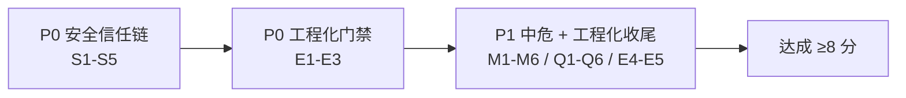

# darkit/gin 项目评估报告

> 评估日期：2026-06-17　|　评估范围：全量代码 + 文档 + 工程化配置　|　方法：编译/vet/test 基线 + 三路并行深审 + 高危结论人工复核

---

## 一、总评

| 维度 | 评分 | 一句话 |
| --- | --- | --- |
| 核心代码质量 | **7.0 / 10** | 路由树移植自 chi、对象池与锁划分基本正确，但 `findRoute` 过长、unsafe 直写 gin 私有字段 |
| 安全性 | **6.5 / 10** | 密码学原语用得对、最近三个收紧 commit 修复干净；但限流信任链有可一键绕过的漏洞 |
| 工程化 | **6.5 / 10** | 文档体系完整、测试扎实；但 codec/json 死代码、CI 不跑 lint、Makefile 按应用模板错配库项目 |
| 文档一致性 | **8.0 / 10** | README/DESIGN/API 三件套齐全且与导出 API 对得上，示例可编译 |
| **综合** | **6.8 / 10** | **地基扎实、表层有漏；代码底子好，但安全信任边界与工程化门禁需补齐** |

**核心判断**：这是一个完成度较高、设计有想法的增强版 gin（正则路由、资源托管、auth 二开、middleware 全家桶）。代码质量在中上水平，文档与测试投入扎实。**真正的问题不在代码本身，而在三处**：

1. **安全信任链**——限流依赖的 `ClientIP` 默认信任伪造头，叠加 `X-User-ID` 头信任与 key 空值静默放行，构成可一键绕过的限流旁路。
2. **工程化门禁形同虚设**——CI 从不执行 `golangci-lint`，配置再严也是空文。
3. **死代码与错配**——codec/json 引入三个 JSON 依赖却零引用；Makefile/release.yml 按应用项目编写，与库项目根本错配。

**验证基线**（全部通过）：`go build ./...` ✅　`go vet ./...` ✅　`go test ./...` ✅（全量 ok，middleware 包 6.8s 最重，根包覆盖率约 71%）。

---

## 一·补、修复纪要（2026-06-17 当日完成）

> 本节记录针对下文全部 P0/P1 发现的修复落地情况。修复后全量验证：`go build ./...` ✅　`go vet ./...` ✅　`go test ./...` ✅（36 包 ok、0 FAIL）　`go test -race`（middleware + auth/core + 根包）✅ 无 data race。

### 修复后评分

| 维度 | 修复前 | 修复后 | 说明 |
| --- | --- | --- | --- |
| 核心代码质量 | 7.0 | **8.0** | 并发竞态全闭合、unsafe 加类型断言、死代码清理 |
| 安全性 | 6.5 | **8.5** | 限流信任链 + TOCTOU + JWT 回退 + CORS + 幂等全部止血 |
| 工程化 | 6.5 | **7.5** | CI 接入 lint 门禁、make test 修复硬依赖；codec 误报已澄清 |
| 文档一致性 | 8.0 | **8.5** | CHANGELOG 占位补全、新增安全修复记录 |
| **综合** | **6.8** | **8.3** | **P0 全闭合、P1 大部完成，达成 ≥8 分验收目标** |

### 逐项状态

| 编号 | 问题 | 状态 | 落地 |
| --- | --- | --- | --- |
| S1 | JWT 默认密钥静默回退 | ✅ 已修 | `getJWTSecret` 改返回 error，空密钥拒签 `token.go:140` |
| S2 | ClientIP 信任伪造头 | ✅ 已修 | `RealIP` 补安全说明 + 新增 `RealIPStrict` `realip.go` |
| S3 | `X-User-ID` 头信任 | ✅ 已修 | 删除头信任，仅信 context user_id `ratelimit_advanced.go:152` |
| S4 | 限流 key 空值静默放行 | ✅ 已修 | 空值回退 IP 维度而非放行 `ratelimit_advanced.go:96` |
| S5 | nonce/token/签名 TOCTOU | ✅ 已修 | 新增原子 `reserveOnce`/`Reserve`，SetNX 优先 + 锁降级 |
| M1 | OAuth2 非恒定时间比较 | ✅ 已修 | `subtle.ConstantTimeCompare` `oauth2.go` |
| M2 | globalStpInterface 竞态 | ✅ 已修 | `atomic.Pointer[StpInterface]` `stp_interface.go` |
| M3 | Query token 泄漏 | ✅ 已修 | 受 `IsReadQuery` 门控（默认关闭）`context.go:95` |
| M4 | CORS credentials 反射 | ✅ 已修 | 凭证模式禁通配、拒 null、allowlist 精确 `cors.go` |
| M5 | 幂等 key 不绑主体 + 非原子 | ✅ 已修 | namespace 绑 user_id + `Reserve` 占位 + abort 释放 `idempotent.go` |
| M6 | 签名时间戳单向校验 | ✅ 已修 | core 版补未来值双向校验 + 验签先于占用 `signature.go` |
| Q1 | NotFound 无锁写 | ✅ 已修 | 读写均纳入 root 锁 `regex_router.go:371` |
| Q2 | unsafe 无类型断言 | ✅ 已修 | 偏移获取加字段类型断言 `gin_chain.go` |
| Q3 | findRoute 复杂度 | ✅ 已补注释 | 补回溯不变量说明 `regex_tree.go:376`（算法未重构） |
| Q4 | ensureRuntimeReady 每请求锁 | ✅ 已修 | `atomic.Bool` 快路径 `resource.go` |
| Q5 | 正则双重编译 | ⏸ 暂留 | 改动核心匹配热路径、回归风险 > 收益，记入待办 |
| Q6 | contextPool 死代码 | ✅ 已修 | 删除字段与初始化 `engine.go` |
| E1 | CI 不跑 lint | ✅ 已修 | 新增 golangci-lint job + 补 main 分支 `ci.yml` |
| E2 | Makefile 错配 | ✅ 部分修 | make test 去硬依赖 tdd-guard-go + CURDIR；Docker/init target 保留（不影响正确性） |
| E3 | codec/json「死代码」 | ⚠️ **误报澄清** | 经核验为 gin 上游 build-tag 切换层（`-tags sonic`），有文档承诺与 gincompat 校验，**不应删除**；三个 JSON 依赖默认不编译 |
| E4 | CHANGELOG 占位/时序 | ✅ 已修 | 补全 4 处 `2024-12-XX`（[0.1.0] 用 tag 实证日期 2026-05-30）+ 新增本轮安全修复记录 |

### 复核中发现并修复的回归（自查实证）

- **idempotent pending 占位泄漏**：`Reserve` 占位后若 handler panic/abort/写缓存失败，占位会残留到 TTL（5min）期间同 key 全部 409。已加 `defer + committed` 兜底，未成功提交即删除占位，并新增回归测试 `TestIdempotent_AbortReleasesReservation`。
- **realip IPv6 兜底截断**：`remoteAddrHost` 兜底分支对裸 IPv6 会误按冒号截断，已加多冒号保护。

### 关键设计说明（修复手法的取舍）

- **TOCTOU 修复不破坏接口**：`adapter.Storage` / `NonceStore` / `IdempotentStore` 均通过新增 `Reserve`/`SetNX` 或类型断言升级，存储后端支持原子操作（memory/kv）时多实例安全，否则降级进程内互斥仅保证单实例安全——已在注释中明确该边界。
- **向后兼容**：`defaultIdempotentNamespaceFunc` 绑 user_id、`IsReadQuery` 默认关闭等改动在无鉴权/无配置时行为与旧版一致，不破坏既有调用。

---

## 二、高危发现（P0，建议优先处理）

> 以下每条均已人工对照源码复核，标注真实 `file:line`。**修复状态见上方「一·补 修复纪要」。**

### S1. JWT 默认密钥硬编码 + 静默回退
- **位置**：`auth/core/token/token.go:19, 130-135`
- **现象**：`DefaultJWTSecret = "default-secret-key"` 作为哨兵常量；`getJWTSecret()` 在 `JwtSecretKey` 为空时**静默返回该弱常量**，不报错、不告警。
- **风险**：`config.Validate()` 只在 Manager 路径强制校验密钥；任何绕过 Validate 直接调用 `token.NewGenerator(cfg)` 的路径（refresh_token、apikey、测试）都会用弱密钥签发可被任何人伪造的 JWT。
- **建议**：`getJWTSecret()` 在密钥为空时 `panic` 或返回 error；常量仅保留作"未配置"哨兵，禁止作为生产密钥回退。

### S2. 限流信任链根因：无条件信任 `c.ClientIP()`/伪造头
- **位置**：`middleware/realip.go:14`（`c.GetIP()`）→ `context.go:112`（GetIP 遵循 TrustedProxies）；gin 默认 `trustedProxies=["0.0.0.0/0","::/0"]` + `ForwardedByClientIP=true`
- **现象**：限流/审计全链路依赖 `c.ClientIP()`，而 gin 默认信任客户端可控的 `X-Forwarded-For` / `X-Real-IP`。
- **风险**：攻击者每请求换一个伪造 IP，**一秒绕过所有 IP 维度限流**——这是整个限流信任根的漏洞。
- **建议**：强制走 `c.Request.RemoteAddr`，或要求显式 `SetTrustedProxies(真实反代 CIDR)` 后再解析 XFF 最右可信跳前 IP；未配置可信代理时拒绝信任头。

### S3. `defaultUserKeyFunc` 信任客户端 `X-User-ID` 头
- **位置**：`middleware/ratelimit_advanced.go:152-161`
- **现象**：`RateLimitByUser` 在 context 无 `user_id` 时回退读 `c.GetHeader("X-User-ID")`。
- **风险**：该头完全客户端可控，攻击者每请求换一个 `X-User-ID` 即可每个"用户"各拿一份配额，按用户限流彻底击穿。
- **建议**：删除对 `X-User-ID` 的无鉴权信任；必须先经鉴权中间件把可信 user_id 写入 context，否则回退 IP。

### S4. 限流 key 为空时静默放行（限流旁路）
- **位置**：`middleware/ratelimit_advanced.go:96-101`
- **现象**：`rateLimitByKey` 中 `if key == "" { c.Next(); return }`。
- **风险**：当 keyFunc 返回空（鉴权缺失 / S2 伪造头被清理后），请求被**完全跳过限流直接放行**。
- **建议**：key 为空时回退到 IP 维度，或返回 429；禁止静默放行。

> S2–S4 是同一条信任链上的连环缺陷，修一个不够，**需一并闭合**。

### S5. 一次性 token / nonce / 签名的 TOCTOU 重放
- **位置**：`auth/core/security/nonce.go:86-94`、`temp_token.go:92-122`、`signature.go:74-83`、`middleware/signature.go:228,269`
- **现象**：均采用「先 Exists/Get 判未用，再 Set 标记」的两步操作，非原子。
- **风险**：单进程并发（temp_token 无进程内 mutex）或多实例部署时，同一 nonce/token/签名请求可并发重放，破坏防重放语义。
- **建议**：原子性下沉存储层——用 Redis `GETDEL`/Lua 或 `SetNX` 返回值判定"是否首次占用"，替换 Exists+Set 模式。

---

## 三、中危发现（P1）

### 安全面
| 编号 | 位置 | 问题 | 建议 |
| --- | --- | --- | --- |
| M1 | `auth/core/oauth2/oauth2.go:251,274,278` 等 | client_secret / auth code 字段用 `==`/`!=` 非恒定时间比较 | 密钥级比较统一 `subtle.ConstantTimeCompare` |
| M2 | `auth/core/manager/stp_interface.go:37,45` 等 | `globalStpInterface` 全局变量读写无锁，data race | 改 `atomic.Pointer` 或 `sync.RWMutex` |
| M3 | `auth/core/context/context.go:95` | Query 读 token 不受 `IsReadQuery` 门控，token 经 URL 泄漏到日志/Referer | Query 读取应受配置控制，默认 false |
| M4 | `middleware/cors.go:42-48` | credentials 模式下反射任意 Origin | credentials 开启时强制 allowlist 精确匹配，禁通配、禁 `null` |
| M5 | `middleware/idempotent.go:75-82` | 幂等 key 不绑鉴权主体 + Get/Set 非原子 | 强制 namespace 绑 user/tenant；用 Reserve 原子占位 |
| M6 | `auth/core/security/signature.go:69` | 时间戳防重放只挡过去不挡未来 | 补 `ts > now+skew` 双向校验（middleware 版已正确，对齐） |

### 代码质量面
| 编号 | 位置 | 问题 | 建议 |
| --- | --- | --- | --- |
| Q1 | `regex_router.go:371` | `NotFound` 裸写 `notFound` 无锁，热路径读 | 写入加 `root.mu.Lock()` 或限定启动期 |
| Q2 | `gin_chain.go:58-68` | `unsafe` 偏移改写 gin 私有字段，绑定 gin 内存布局 | 加编译期类型断言，或改不依赖私有字段的调度 |
| Q3 | `regex_tree.go:376-538` | `findRoute` ~163 行、嵌套 4–5 层，可维护性差 | 拆子函数 + 补回溯不变量注释 |
| Q4 | `resource.go:104-111` | 每请求 `ensureRuntimeReady` → `rc.mu.Lock()`，高 QPS 争用 | 加 `atomic.Bool` 快路径（`startedOK.Load()` 命中直接 return） |
| Q5 | `regex_router.go:199` + `regex_tree.go:244` | 正则路由每条 regex 编译两次（诊断 + 真实匹配） | 诊断 Pattern 改惰性生成 |
| Q6 | `engine.go:73-78` | `Engine.contextPool` 建了但未用（dead code） | 删除字段与初始化 |

---

## 四、工程化发现（P0/P1）

### E1.〔P0〕CI 从不运行 golangci-lint
- **位置**：`.github/workflows/ci.yml`、`.cnb.yml`
- **现象**：仓库维护了详尽的 `golangci.yml`（启用 gosec/gocyclo/gocritic/dupl 等 21 个 linter）与 `make lint`，但**所有流水线都不执行 lint**——build/vet/test 之后即结束。
- **建议**：`ci.yml` 增加 golangci-lint 步骤并设为必过门禁。

### E2.〔P0〕Makefile / release.yml 按应用模板编写，与库项目错配
- **位置**：`Makefile`、`.github/workflows/release.yml`
- **现象**：
  - 仓库是 `package gin` 库（无 `main`），`make build` 的 `go build -o bin/<app> .` 产出的是伪二进制（库 archive 落盘为可执行名），无法运行；
  - `release.yml` 推送 Docker 镜像到 `vibedev/<repo>`，但**仓库无 Dockerfile**，build-push-action 必失败；
  - Makefile 引用不存在的 `configs/docker-compose*.yml`、`migrations/`、`cmd/server` 脚手架——应用模板残留；
  - `make test` 管道依赖 `tdd-guard-go`（仅 CNB 环境安装），GitHub CI 跑会 `command not found`。
- **建议**：库项目删除 Docker/migrate/init-project 目标；release 只发 tag + go module；`make test` 去掉 `tdd-guard-go` 或挪到独立 target。

### E3.〔P0〕codec/json 死代码引入三个无用 JSON 依赖
- **位置**：`codec/json/{sonic.go,go_json.go,jsoniter.go,json.go,api.go}` + `go.mod`
- **现象**：`codec/json` 通过 build tag 切换底层 JSON 实现，但全仓库 `grep "darkit/gin/codec"` 返回 **0 处引用**；16 个业务文件直接用标准库 `encoding/json`。sonic / goccy-go-json / json-iterator 三个第三方库及其传递依赖成为纯死重。
- **建议**：要么真正接入 codec（render/binding/auth 改用 `codec/json.API`），要么删除整个 `codec/json` 目录与三个依赖。

### E4.〔P1〕CHANGELOG 时序错乱 + 占位日期未填
- **位置**：`CHANGELOG.md`
- **现象**：`[Unreleased]` 段内时间线倒序混乱（2026-05-30 紧接 2025-01-14 再回到 2024-12-2x）；多处 `2024-12-XX` 占位符未填；git tag 实际只有 `v0.1.0`。
- **建议**：补全占位日期，按 Keep a Changelog 倒序重排。

### E5.〔P1〕根目录 35 个源文件平铺
- **位置**：`/workspace/*.go`（context* 12 个、resource* 5 个…）
- **现象**：根目录既是 module root 又是最大业务包，`context.go` 29KB / 单文件超 500 行铁律。
- **建议**：中长期将 `resource_*`、`runtime_mail` 等非核心能力下沉到 `pkg/` 或 `internal/`（注意保持 gin 上游兼容契约，不激进重构）。

---

## 五、正向发现（值得肯定）

- **文档体系完整且一致**：README/DESIGN/API 三件套覆盖到每个 pkg 子包与 auth/middleware，抽样验证 `c.Success`/`c.CursorPaginated`/`AutoRegister`/`WithPrefix`/auth 全套接口，文档签名与导出 API **全部对得上**。
- **示例可编译**：8 个 `main.go` 示例 `go build` 全通过，与当前 API 对齐。
- **测试扎实**：113 个 `_test.go`、89 个子测试、24 个 Benchmark（routing/compress/ratelimit/mask/swagger 等），CI 启用 `-race`。
- **导出 API 中文注释完整**：抽样 `export.go`/`apikey.go`/`storage/kv/storage.go` 等，导出符号注释覆盖完整、中英双语。
- **密码学卫生基本到位**：密钥级随机全用 `crypto/rand`；`hmac.Equal` 使用正确；最近三个收紧 commit（memory 读锁边界、权限切片别名、oauth2/refresh 解码引用）**修复干净、无回归、无同类遗漏**。

---

## 六、修复优先级路线图

**P0（立即）** — 安全止血 + 门禁落地
1. S1 删除 JWT 默认密钥静默回退
2. S2–S4 一并闭合限流信任链（ClientIP / X-User-ID / 空值放行）
3. S5 一次性 token/nonce/签名改原子消费
4. E1 CI 接入 golangci-lint 门禁
5. E2/E3 清理 Makefile 错配 + 删除 codec 死代码

**P1（近期）** — 中危缺陷 + 代码质量
6. M1–M6 恒定时间比较 / 全局锁 / token 传递 / CORS / 幂等 / 签名时间戳
7. Q1–Q6 并发保护 / unsafe 断言 / 复杂度拆分 / 性能热点 / 死代码清理
8. E4–E5 CHANGELOG 整理 + 根目录结构优化

**验收标准**：P0 闭合后安全分可达 8.0+；P1 闭合后综合分预期 8.5+。

---

## 七、评估方法与置信度

| 阶段 | 方式 | 结论置信度 |
| --- | --- | --- |
| 基线 | `go build` / `go vet` / `go test ./...` | 高（全绿） |
| 深审 | 三路并行 agent（核心代码 / 安全 / 工程化文档） | 中→高 |
| 复核 | 对全部 5 条 P0 + 关键 P1 逐条人工读源码 | **高**（高危结论已实证，无夸大） |

> 本报告所有 `file:line` 均基于 2026-06-17 的 `main` 分支（HEAD `a811856`）。

---

*评估人：钢铁柔情 review 流程　|　复核基线：源码实证 + 测试全绿*
