# 业务流程说明

## 目录
- [1. 业务流程概述](#1-业务流程概述)
- [2. 核心流程详细说明](#2-核心流程详细说明)
  - [2.1 请求处理流程](#21-请求处理流程)
  - [2.2 认证授权流程](#22-认证授权流程)
  - [2.3 数据验证流程](#23-数据验证流程)
  - [2.4 文件上传流程](#24-文件上传流程)
  - [2.5 SSE事件推送流程](#25-sse事件推送流程)
- [3. 异常处理流程](#3-异常处理流程)
- [4. 并发控制流程](#4-并发控制流程)
- [5. 业务场景流程示例](#5-业务场景流程示例)

## 1. 业务流程概述

Gin扩展框架的业务流程主要围绕HTTP请求的处理、认证授权、数据验证和响应生成等核心环节展开。框架通过扩展原生Gin上下文，提供了更加便捷和规范的API设计模式，简化了常见Web应用开发任务的流程。

本文档详细描述了框架中的核心业务流程，包括流程图、关键判断点和处理路径，帮助开发者理解框架的内部工作机制，更高效地使用框架进行开发。

## 2. 核心流程详细说明

### 2.1 请求处理流程

请求处理流程是框架最基础的业务流程，描述了从接收HTTP请求到返回响应的完整流程。

#### 2.1.1 基本流程图

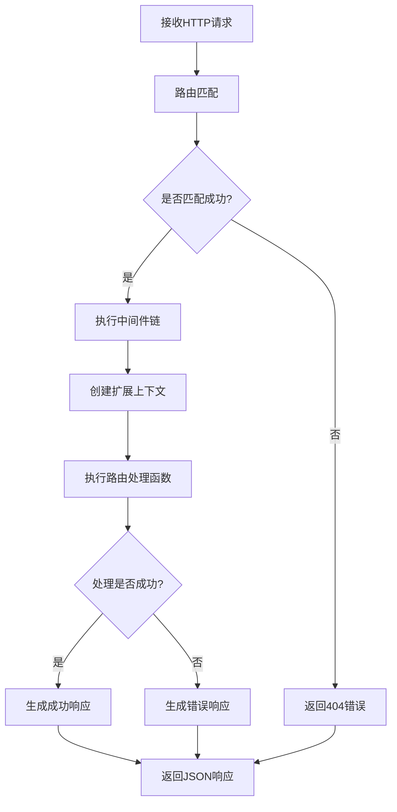

#### 2.1.2 关键步骤说明

1. **路由匹配**
   - 系统根据请求的路径和HTTP方法匹配注册的路由
   - 如果找不到匹配的路由，返回404错误

2. **中间件执行**
   - 按照注册顺序依次执行全局中间件
   - 然后执行路由组中间件
   - 最后执行路由特定中间件

3. **扩展上下文创建**
   - 基于原生gin.Context创建扩展的Context对象
   - 注入框架提供的额外功能和工具方法

4. **路由处理函数执行**
   - 使用扩展的Context执行开发者定义的处理逻辑
   - 处理业务规则和数据操作

5. **响应生成**
   - 根据处理结果生成统一格式的响应
   - 成功响应使用Success/SuccessWithMsg方法
   - 失败响应使用Fail/Error方法

#### 2.1.3 判断点和处理路径

| 判断点 | 条件 | 处理路径 |
|-------|------|--------|
| 路由匹配 | 未找到匹配路由 | 返回404错误 |
| 中间件验证 | 验证失败(如认证失败) | 中止请求，返回错误 |
| 参数验证 | 必需参数缺失 | 返回400错误，参数错误信息 |
| 业务处理 | 业务规则验证失败 | 返回业务错误响应 |
| 系统异常 | 处理过程出现异常 | 返回500错误，记录错误日志 |

### 2.2 认证授权流程

认证授权流程描述了如何验证用户身份并授权访问受保护资源的过程。

#### 2.2.1 JWT认证流程图

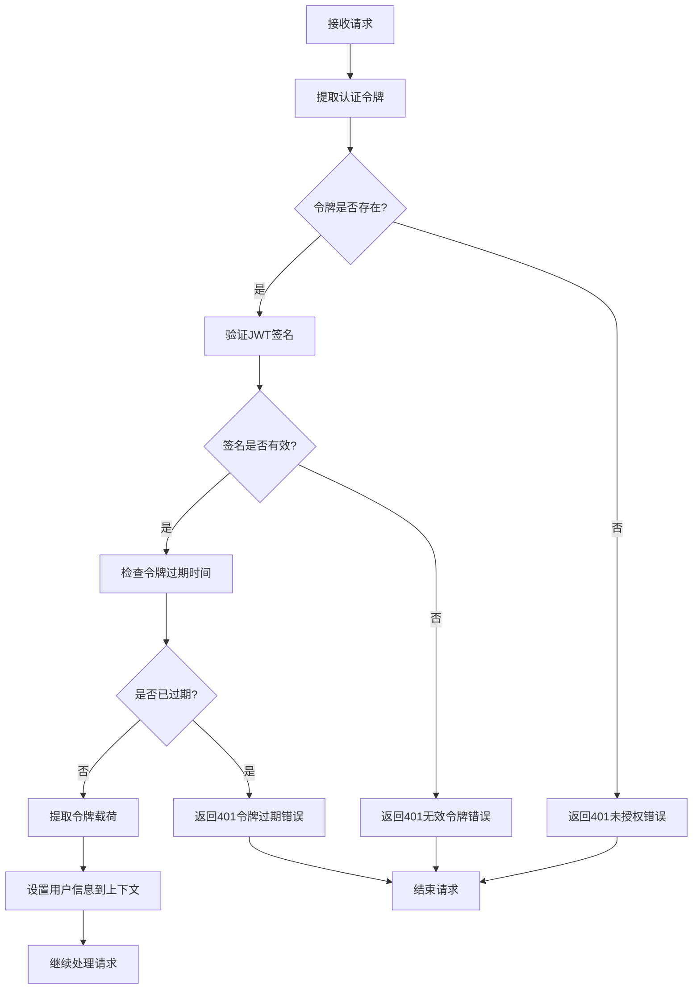

#### 2.2.2 关键步骤说明

1. **令牌提取**
   - 从请求头的Authorization字段提取Bearer令牌
   - 或从查询参数、Cookie中提取令牌（可配置）

2. **JWT签名验证**
   - 使用密钥验证令牌签名是否有效
   - 检查令牌格式是否符合JWT标准

3. **过期检查**
   - 验证令牌中的exp声明是否已过期
   - 验证nbf声明（如果存在）确保令牌已生效

4. **载荷提取**
   - 从验证通过的令牌中提取用户信息和自定义声明
   - 设置到请求上下文中供后续处理使用

#### 2.2.3 判断点和处理路径

| 判断点 | 条件 | 处理路径 |
|-------|------|--------|
| 令牌存在检查 | 请求中无令牌 | 返回401错误，未提供认证信息 |
| 签名验证 | 签名无效或格式错误 | 返回401错误，无效的认证令牌 |
| 过期检查 | 令牌已过期 | 返回401错误，认证令牌已过期 |
| 令牌声明验证 | 必需声明缺失 | 返回401错误，认证令牌格式不正确 |
| 权限检查 | 权限不足 | 返回403错误，无权访问资源 |

### 2.3 数据验证流程

数据验证流程描述了如何验证和处理用户提交的数据，确保数据符合业务规则和格式要求。

#### 2.3.1 数据验证流程图

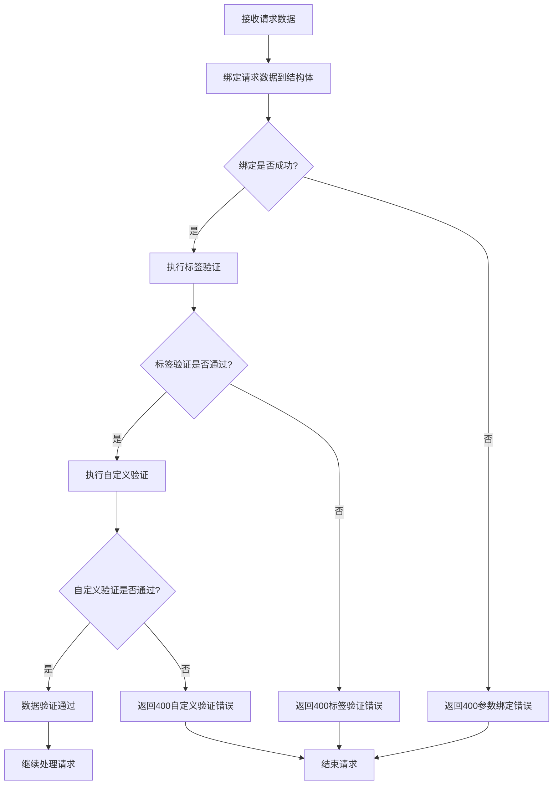

#### 2.3.2 关键步骤说明

1. **数据绑定**
   - 根据请求Content-Type将请求数据绑定到Go结构体
   - 支持JSON、XML、表单数据等多种格式

2. **标签验证**
   - 使用结构体字段标签进行基本验证
   - 如required、min、max、email等验证规则

3. **自定义验证**
   - 实现Validator接口的自定义验证逻辑
   - 处理复杂的业务规则和跨字段验证

4. **错误处理**
   - 收集所有验证错误并格式化
   - 生成统一的错误响应

#### 2.3.3 判断点和处理路径

| 判断点 | 条件 | 处理路径 |
|-------|------|--------|
| 数据绑定 | 请求数据格式错误 | 返回400错误，数据格式不正确 |
| 标签验证 | 字段不符合标签规则 | 返回400错误，包含具体字段错误 |
| 自定义验证 | 不符合业务规则 | 返回400错误，包含业务规则说明 |
| 类型转换 | 类型转换失败 | 返回400错误，参数类型错误 |
| 必需参数检查 | 必需参数缺失 | 返回400错误，参数缺失错误 |

### 2.4 文件上传流程

文件上传流程描述了如何处理和验证用户上传的文件，并安全地存储到指定位置。

#### 2.4.1 文件上传流程图

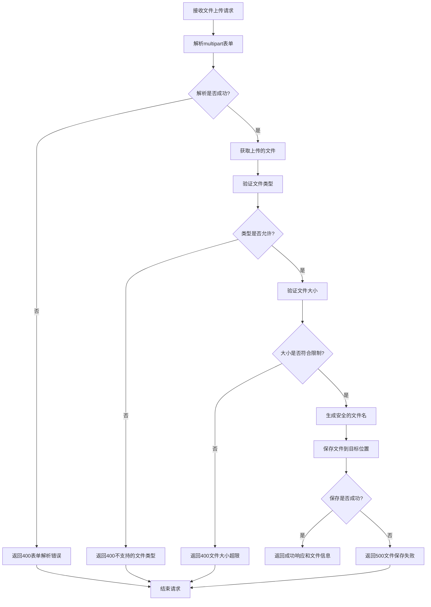

#### 2.4.2 关键步骤说明

1. **表单解析**
   - 解析multipart/form-data表单数据
   - 提取文件对象和相关表单字段

2. **文件验证**
   - 验证文件类型是否在允许列表中
   - 验证文件大小是否在限制范围内
   - 验证文件内容是否安全（可选）

3. **文件保存**
   - 生成安全的唯一文件名
   - 创建目标目录（如果不存在）
   - 将文件保存到指定位置

4. **响应生成**
   - 返回文件保存结果和相关信息
   - 包括文件ID、访问URL等

#### 2.4.3 判断点和处理路径

| 判断点 | 条件 | 处理路径 |
|-------|------|--------|
| 表单解析 | 解析失败 | 返回400错误，表单格式不正确 |
| 文件存在检查 | 表单中无文件 | 返回400错误，未找到上传文件 |
| 文件类型检查 | 不支持的文件类型 | 返回400错误，文件类型不允许 |
| 文件大小检查 | 文件过大 | 返回400错误，文件超过大小限制 |
| 文件保存 | 保存失败(磁盘已满等) | 返回500错误，文件保存失败 |

### 2.5 SSE事件推送流程

SSE事件推送流程描述了如何建立和维护服务器发送事件(SSE)连接，实现服务器到客户端的实时消息推送。

#### 2.5.1 SSE事件推送流程图

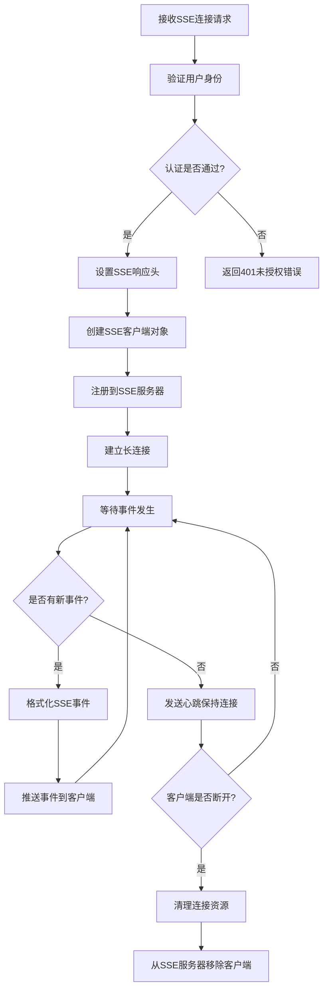

#### 2.5.2 关键步骤说明

1. **连接建立**
   - 验证客户端身份和权限
   - 设置SSE特定的HTTP响应头
   - 创建唯一的客户端标识符

2. **客户端管理**
   - 将客户端添加到SSE服务器的客户端列表
   - 根据客户端属性分组（可选）
   - 监控连接状态

3. **事件推送**
   - 监听应用内的事件源
   - 根据事件类型和目标格式化SSE事件
   - 推送事件到客户端或广播到多个客户端

4. **连接维护**
   - 定期发送注释行作为心跳
   - 检测断开的连接并清理资源
   - 处理重连请求和Last-Event-ID头

#### 2.5.3 判断点和处理路径

| 判断点 | 条件 | 处理路径 |
|-------|------|--------|
| 认证检查 | 认证失败 | 返回401错误，未授权连接 |
| 权限检查 | 无事件接收权限 | 返回403错误，无权限接收事件 |
| 客户端连接限制 | 超出单用户连接数上限 | 返回429错误，连接数过多 |
| 心跳检测 | 客户端无响应 | 关闭连接，清理资源 |
| 事件过滤 | 客户端未订阅该事件类型 | 不向该客户端推送事件 |

## 3. 异常处理流程

异常处理流程描述了框架如何捕获和处理各类异常，保障应用的稳定性和可靠性。

### 3.1 异常处理流程图

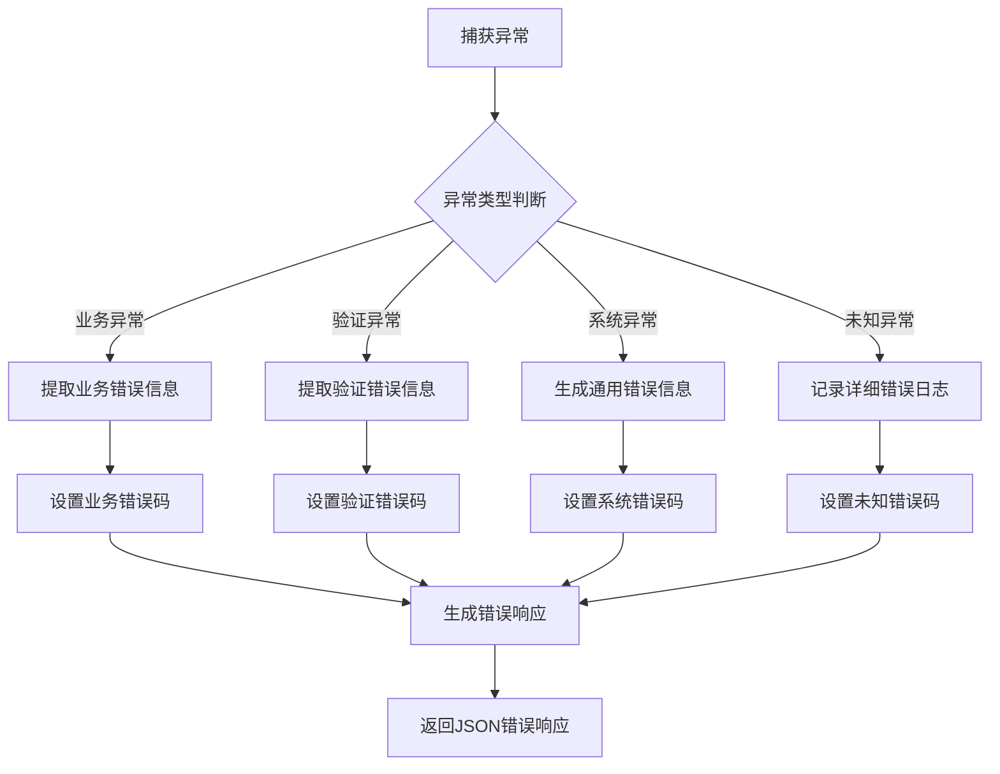

### 3.2 关键步骤说明

1. **异常捕获**
   - 使用中间件捕获路由处理过程中的panic
   - 捕获业务逻辑中返回的错误

2. **异常分类**
   - 将异常分为业务异常、验证异常、系统异常和未知异常
   - 根据异常类型进行不同处理

3. **错误信息生成**
   - 提取异常中的错误信息和上下文
   - 生成对用户友好的错误消息
   - 对敏感信息进行脱敏处理

4. **日志记录**
   - 记录详细的错误信息和堆栈跟踪
   - 设置错误级别和上下文信息
   - 对严重错误进行告警

### 3.3 判断点和处理路径

| 判断点 | 条件 | 处理路径 |
|-------|------|--------|
| 异常类型 | 业务异常 | 返回业务错误码和消息(400系列) |
| 异常类型 | 验证异常 | 返回验证错误码和详细字段错误(400系列) |
| 异常类型 | 系统异常 | 返回系统错误码和通用消息(500系列) |
| 异常类型 | 未知异常 | 记录日志，返回通用错误消息(500) |
| 敏感信息检测 | 包含敏感信息 | 对错误消息进行脱敏处理 |

## 4. 并发控制流程

并发控制流程描述了框架如何处理并发请求和资源竞争，确保系统在高并发场景下的稳定性和一致性。

### 4.1 并发控制流程图

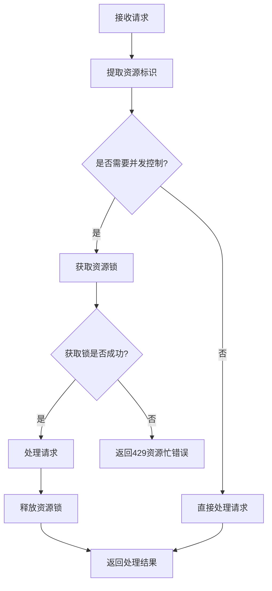

### 4.2 关键步骤说明

1. **资源标识提取**
   - 根据请求参数或路径提取资源标识
   - 确定是否需要并发控制

2. **资源锁管理**
   - 尝试获取资源锁，支持读写分离
   - 设置锁超时时间防止死锁
   - 处理锁获取失败的情况

3. **请求处理**
   - 在锁保护下处理请求
   - 确保资源状态一致性

4. **锁释放**
   - 处理完成后及时释放锁
   - 处理异常情况下的锁释放

### 4.3 判断点和处理路径

| 判断点 | 条件 | 处理路径 |
|-------|------|--------|
| 并发控制需要 | 操作需要并发控制 | 尝试获取资源锁 |
| 锁获取 | 锁获取成功 | 处理请求并释放锁 |
| 锁获取 | 锁获取失败 | 返回429错误，资源暂时不可用 |
| 锁超时 | 处理时间超过锁超时 | 释放锁，返回处理中断错误 |
| 异常处理 | 处理过程异常 | 确保锁正确释放 |

## 5. 业务场景流程示例

以下是一些常见业务场景的流程示例，展示了框架如何处理实际业务需求。

### 5.1 用户注册与登录流程

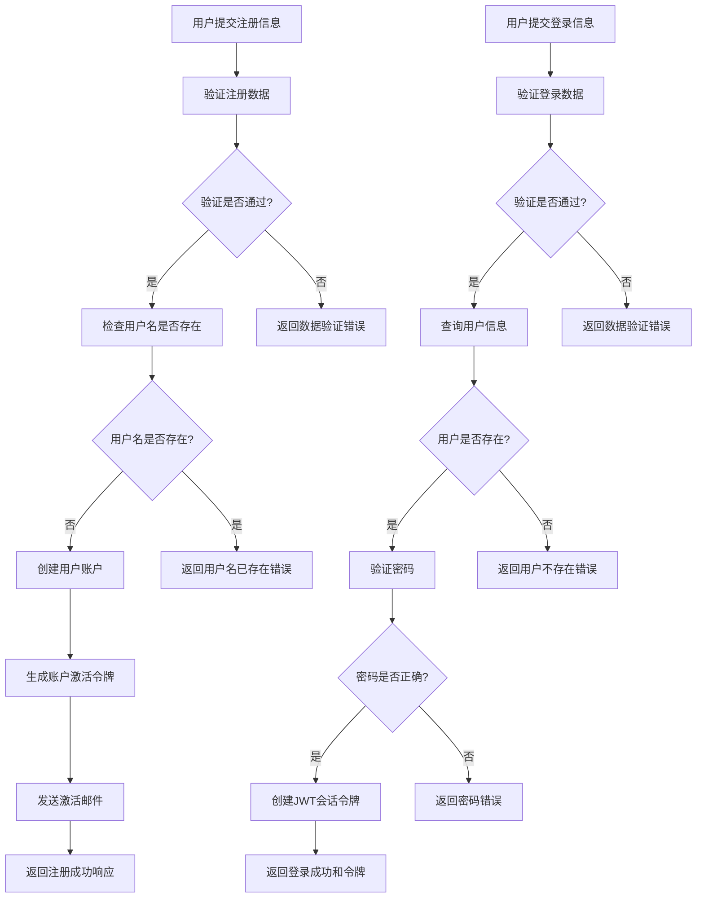

### 5.2 数据分页查询流程

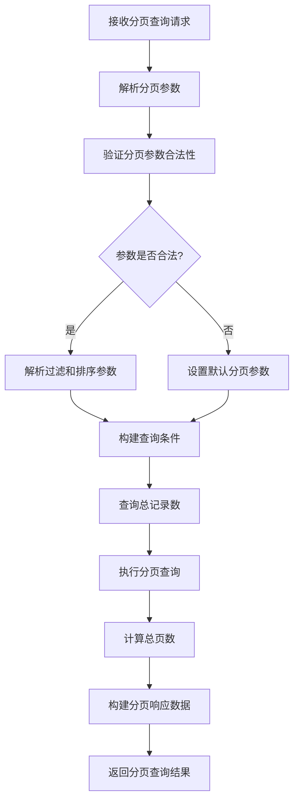

### 5.3 文件上传和处理流程

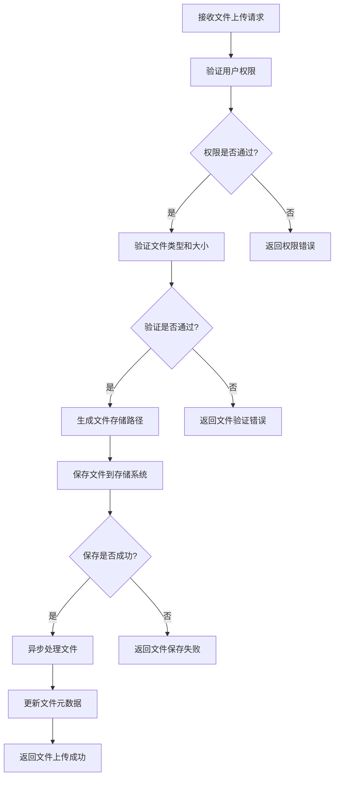

### 5.4 实时通知推送流程

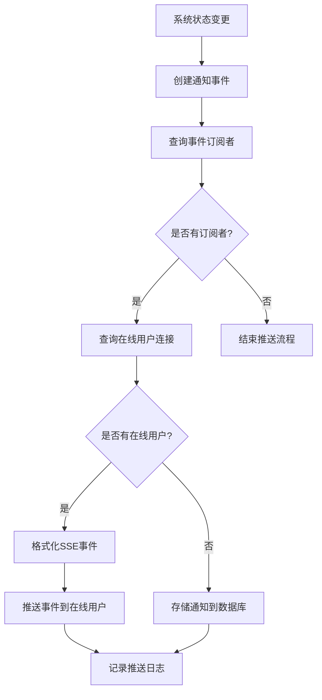