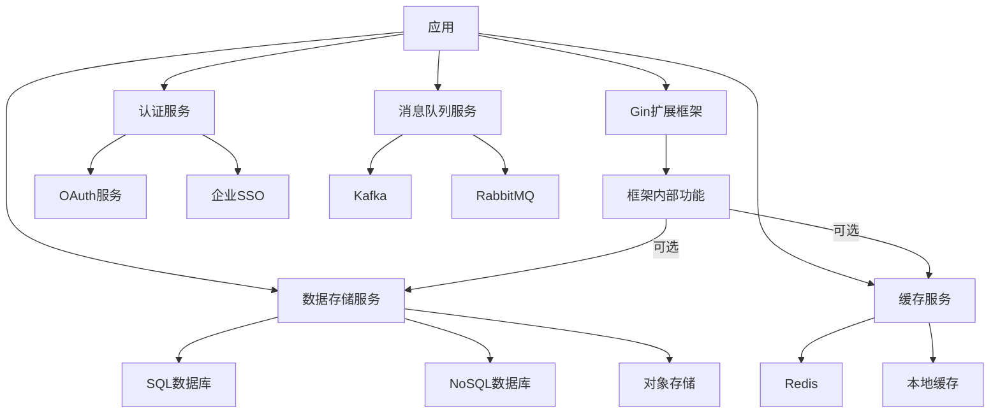

# 外部依赖说明

## 目录
- [1. 概述](#1-概述)
- [2. 核心依赖](#2-核心依赖)
- [3. 可选依赖](#3-可选依赖)
- [4. 开发依赖](#4-开发依赖)
- [5. 下游服务](#5-下游服务)
- [6. 依赖管理](#6-依赖管理)
- [7. 安全注意事项](#7-安全注意事项)

## 1. 概述

Gin扩展框架在设计上遵循"最小依赖原则"，只引入必要的外部依赖。本文档列出了框架的核心依赖、可选依赖以及与下游服务的调用关系，帮助开发者理解框架的依赖结构，以便更好地使用和扩展框架。

框架的依赖分为以下几类：
- **核心依赖**：框架正常运行所必需的依赖
- **可选依赖**：提供额外功能的可选依赖，按需引入
- **开发依赖**：仅在开发和测试阶段使用的依赖
- **下游服务**：框架可能会调用的外部服务

## 2. 核心依赖

### 2.1 基础框架

#### 2.1.1 github.com/gin-gonic/gin v1.10.1

**用途**：基础HTTP框架  
**版本要求**：>= v1.9.0  
**许可证**：MIT  

**主要使用的功能**：
- HTTP请求路由和处理
- 中间件支持
- 请求参数解析
- 响应生成

**依赖方式**：直接依赖，框架的核心功能基于Gin构建。

#### 2.1.2 github.com/go-playground/validator/v10 v10.26.0

**用途**：数据验证库  
**版本要求**：>= v10.20.0  
**许可证**：MIT  

**主要使用的功能**：
- 结构体标签验证
- 自定义验证规则
- 验证错误处理

**依赖方式**：直接依赖，用于参数验证和数据校验。

### 2.2 辅助库

#### 2.2.1 github.com/goccy/go-json v0.10.5

**用途**：高性能JSON处理库  
**版本要求**：>= v0.10.0  
**许可证**：MIT  

**主要使用的功能**：
- JSON编码和解码
- JSON格式化

**依赖方式**：直接依赖，提供比标准库更高性能的JSON处理。

#### 2.2.2 golang.org/x/crypto v0.36.0

**用途**：密码学功能  
**版本要求**：>= v0.30.0  
**许可证**：BSD-3-Clause  

**主要使用的功能**：
- JWT签名和验证
- 密码哈希
- 安全随机数生成

**依赖方式**：直接依赖，用于认证和安全功能实现。

#### 2.2.3 github.com/google/uuid v1.6.0

**用途**：UUID生成  
**版本要求**：>= v1.5.0  
**许可证**：BSD-3-Clause  

**主要使用的功能**：
- 生成唯一标识符
- 会话ID和请求ID生成

**依赖方式**：间接依赖，通过内部工具包使用。

## 3. 可选依赖

### 3.1 数据库支持

#### 3.1.1 github.com/mattn/go-sqlite3 v1.14.22

**用途**：SQLite数据库驱动  
**版本要求**：>= v1.14.20  
**许可证**：MIT  

**主要使用的功能**：
- SQLite数据库连接
- 轻量级存储

**依赖方式**：可选依赖，仅在使用SQLite存储时需要。

#### 3.1.2 github.com/redis/go-redis/v9 v9.5.1

**用途**：Redis客户端  
**版本要求**：>= v9.5.0  
**许可证**：BSD-2-Clause  

**主要使用的功能**：
- Redis连接和操作
- 缓存和会话存储

**依赖方式**：可选依赖，仅在使用Redis缓存或会话存储时需要。

### 3.2 日志处理

#### 3.2.1 go.uber.org/zap v1.27.0

**用途**：高性能日志库  
**版本要求**：>= v1.25.0  
**许可证**：MIT  

**主要使用的功能**：
- 结构化日志记录
- 日志级别管理
- 性能优化的日志处理

**依赖方式**：可选依赖，可替换为其他日志库。

### 3.3 监控与追踪

#### 3.3.1 go.opentelemetry.io/contrib/instrumentation/github.com/gin-gonic/gin/otelgin v0.49.0

**用途**：OpenTelemetry集成  
**版本要求**：>= v0.45.0  
**许可证**：Apache-2.0  

**主要使用的功能**：
- 分布式追踪
- 请求监控
- 性能指标收集

**依赖方式**：可选依赖，仅在需要APM和分布式追踪时使用。

## 4. 开发依赖

### 4.1 测试工具

#### 4.1.1 github.com/stretchr/testify v1.9.0

**用途**：测试辅助库  
**版本要求**：>= v1.8.0  
**许可证**：MIT  

**主要使用的功能**：
- 断言和测试辅助
- Mock对象创建
- 测试套件管理

**依赖方式**：仅用于测试，不会包含在生产代码中。

#### 4.1.2 github.com/golang/mock v1.6.0

**用途**：Mock生成工具  
**版本要求**：>= v1.6.0  
**许可证**：Apache-2.0  

**主要使用的功能**：
- 自动生成Mock对象
- 接口模拟

**依赖方式**：仅用于测试，不会包含在生产代码中。

### 4.2 代码质量工具

#### 4.2.1 golang.org/x/lint v0.0.0-20210508222113-6edffad5e616

**用途**：代码质量检查  
**版本要求**：最新版  
**许可证**：BSD-3-Clause  

**主要使用的功能**：
- 代码静态分析
- 风格检查

**依赖方式**：仅用于开发环境，不会包含在生产代码中。

## 5. 下游服务

框架主要关注于Web请求处理层，自身不直接依赖外部服务。但是，使用框架的应用可能会集成以下类型的下游服务：

### 5.1 数据存储服务

**可能的集成**：
- 关系型数据库（MySQL、PostgreSQL等）
- NoSQL数据库（MongoDB、Cassandra等）
- 键值存储（Redis、Memcached等）
- 对象存储（S3、OSS等）

**调用方式**：应用层通过对应的客户端库进行集成，框架提供辅助工具简化集成流程。

**框架提供的支持**：
- 连接池管理辅助
- 事务处理辅助
- 错误处理和重试机制

### 5.2 认证服务

**可能的集成**：
- OAuth 2.0提供商
- OpenID Connect服务
- 企业SSO系统
- 自定义认证系统

**调用方式**：通过HTTP客户端调用外部认证API，或使用SDK集成。

**框架提供的支持**：
- JWT处理工具
- 身份验证中间件
- 会话管理

### 5.3 消息队列服务

**可能的集成**：
- Kafka
- RabbitMQ
- NATS
- AWS SQS

**调用方式**：通过对应的客户端库进行集成。

**框架提供的支持**：
- 事件发布订阅模式
- 消息处理辅助
- 连接管理

### 5.4 缓存服务

**可能的集成**：
- Redis
- Memcached
- 本地内存缓存

**调用方式**：通过对应的客户端库进行集成。

**框架提供的支持**：
- 缓存抽象层
- 缓存键管理
- 缓存策略配置

### 5.5 服务调用关系图

## 6. 依赖管理

### 6.1 版本控制策略

项目使用Go Modules进行依赖管理，遵循以下原则：

1. **依赖版本明确固定**：在go.mod中明确指定依赖的最低版本要求
2. **间接依赖版本控制**：对重要的间接依赖也进行版本控制
3. **定期依赖更新**：定期更新依赖以获取安全修复和性能改进
4. **语义化版本**：遵循语义化版本规范，确保兼容性

### 6.2 依赖审计

1. **安全扫描**：使用工具定期扫描依赖中的安全漏洞
2. **许可证检查**：确保所有依赖的许可证与项目兼容
3. **依赖健康度评估**：评估依赖的维护状态和社区活跃度
4. **最小化依赖数量**：尽可能减少依赖数量，避免依赖膨胀

### 6.3 依赖替换指南

框架设计为高度可配置，核心依赖可按需替换：

1. **JSON库替换**：可替换默认的JSON库为标准库或其他实现
2. **日志库替换**：可替换默认的日志库为自定义实现
3. **验证库替换**：可使用自定义验证机制替换默认验证库
4. **存储层替换**：可根据需求替换存储层实现

## 7. 安全注意事项

### 7.1 依赖相关安全建议

1. **定期更新**：定期更新依赖以获取安全修复
2. **限制依赖权限**：遵循最小权限原则，限制依赖的访问权限
3. **审计第三方代码**：审计关键依赖的代码，特别是涉及安全功能的部分
4. **使用依赖扫描工具**：在CI/CD流程中集成依赖扫描工具

### 7.2 下游服务安全措施

1. **连接加密**：与下游服务的连接必须使用加密传输（TLS/SSL）
2. **认证凭证保护**：连接下游服务的认证信息应安全存储，避免硬编码
3. **错误信息处理**：不向客户端暴露下游服务的敏感错误信息
4. **超时和断路器**：实施适当的超时机制和断路器模式，防止级联故障
5. **数据验证**：对从下游服务获取的数据进行验证，避免信任边界问题 