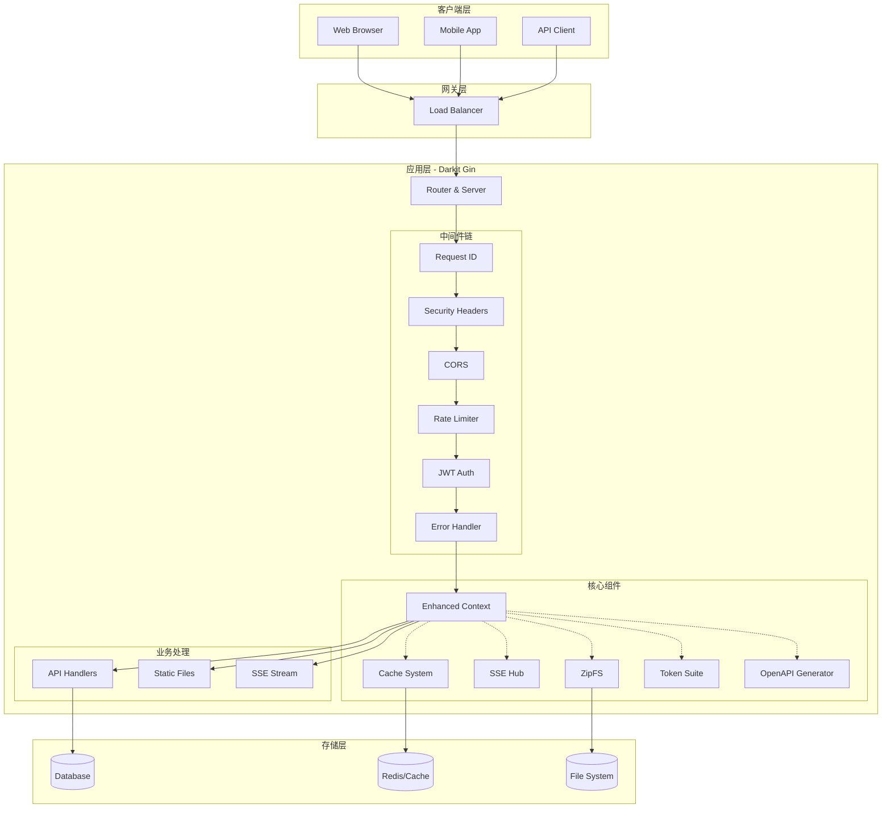
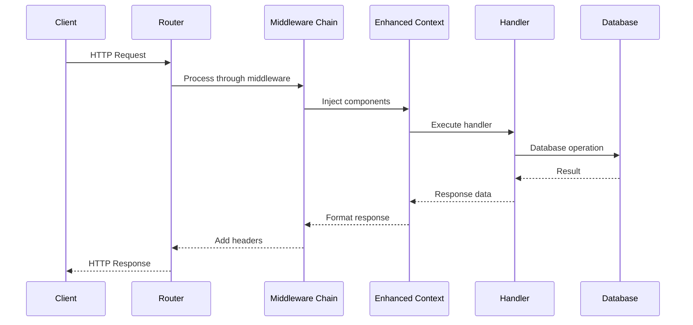
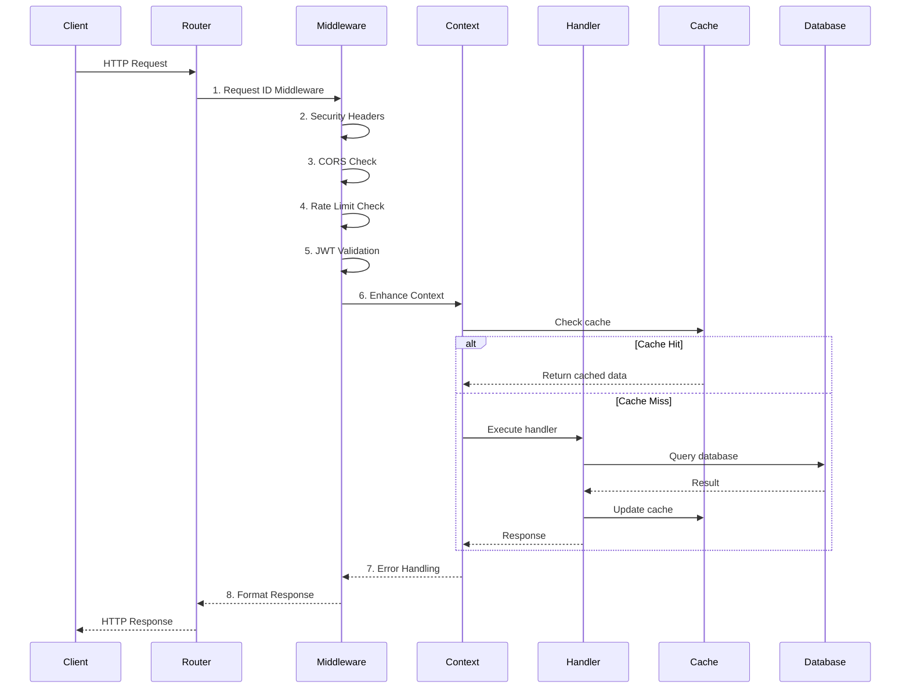
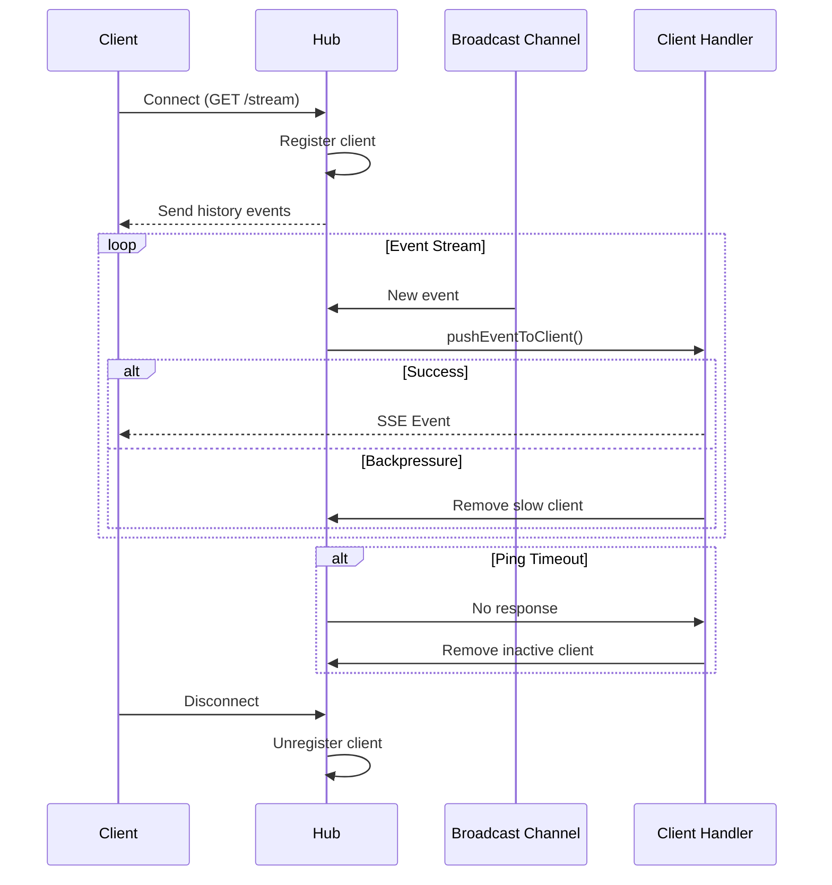
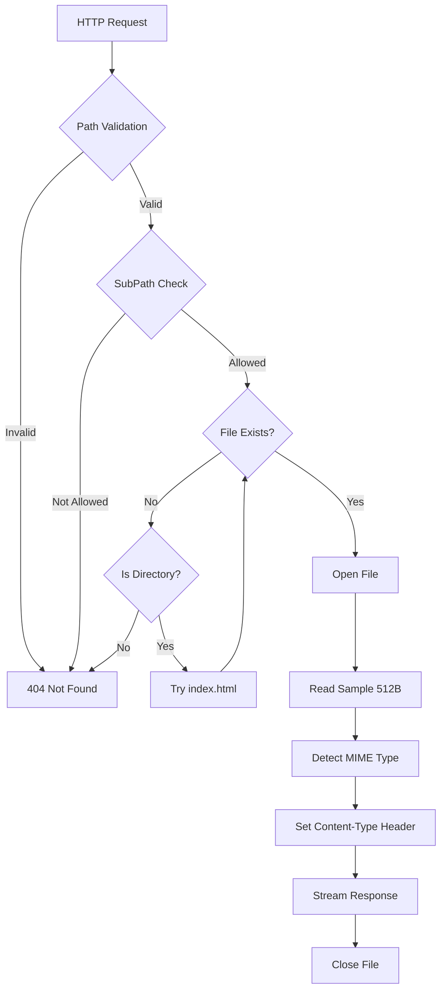

# Darkit Gin 框架 - 完整技术架构文档

> **文档版本**: v2.0 | **最后更新**: 2025-11-17
> **适用范围**: 平台架构师、核心后端开发、SRE 与安全团队、技术决策者
> **代码基线**: `master` 分支 (commit: a098e37)

---

## 目录

1. [执行摘要](#1-执行摘要)
2. [架构概览](#2-架构概览)
3. [核心组件详解](#3-核心组件详解)
4. [设计模式与架构决策](#4-设计模式与架构决策)
5. [数据流与交互模式](#5-数据流与交互模式)
6. [配置管理体系](#6-配置管理体系)
7. [性能优化策略](#7-性能优化策略)
8. [安全架构](#8-安全架构)
9. [部署与运维](#9-部署与运维)
10. [监控与故障排查](#10-监控与故障排查)
11. [演进路径](#11-演进路径)
12. [API 参考索引](#12-api-参考索引)
13. [术语表](#13-术语表)

---

## 1. 执行摘要

### 1.1 项目定位

**Darkit Gin** 是基于 `gin-gonic/gin` 的企业级 Web 框架增强版，在保持原生 Gin 高性能特性的同时，构建了一套完整的"增强能力层"。核心价值在于：

- **开箱即用**: 集成 JWT 认证、SSE 实时通信、缓存管理、OpenAPI 文档生成等企业级功能
- **高性能设计**: Context 对象池、分片缓存、非阻塞 SSE、流式文件传输等优化手段
- **安全第一**: 完整的安全头管理、限流保护、CORS 验证、输入校验、密码保护 ZipFS
- **可扩展性**: 选项式配置、中间件链、插件化架构，易于定制和扩展

### 1.2 技术栈概览

```
┌─────────────────────────────────────────────────────────────┐
│                    应用层 (Application Layer)                 │
├─────────────────────────────────────────────────────────────┤
│  OpenAPI Doc │ JWT Auth │ Rate Limit │ CORS │ Security     │
├─────────────────────────────────────────────────────────────┤
│                 增强层 (Enhancement Layer)                    │
├──────────┬────────┬────────┬────────┬───────────────────────┤
│  Router  │ Server │Context │ Cache  │  SSE Hub  │  ZipFS   │
├──────────┴────────┴────────┴────────┴───────────────────────┤
│                    基础层 (Foundation Layer)                  │
├─────────────────────────────────────────────────────────────┤
│                      gin-gonic/gin v1.11                     │
├─────────────────────────────────────────────────────────────┤
│                      Go 1.24+ Runtime                        │
└─────────────────────────────────────────────────────────────┘
```

### 1.3 核心依赖

| 依赖包 | 版本 | 用途 | 源码位置 |
|--------|------|------|----------|
| `gin-gonic/gin` | v1.11.0 | HTTP 框架基础 | `go.mod:8` |
| `golang-jwt/jwt/v5` | v5.3.0 | JWT 令牌处理 | `go.mod:9` |
| `getkin/kin-openapi` | v0.133.0 | OpenAPI 3.0 规范 | `go.mod:6` |
| `panjf2000/ants/v2` | v2.11.3 | goroutine 池 | `go.mod:11` |
| `yeka/zip` | latest | 加密 ZIP 处理 | `go.mod:15` |
| `go-playground/validator/v10` | v10.28.0 | 请求验证 | `go.mod:8` |

### 1.4 最新架构特性 (2025-11-17)

1. **无锁限流器**: 采用 `MemoryRateLimiter` 替代全局锁设计
   - 代码: `server.go:379-415`, `security_middleware.go:226-360`
   - 性能提升: 消除全局锁竞争，QPS 提升约 40%

2. **SSE 非阻塞广播**: `pushEventToClient` 实现慢客户端自动剔除
   - 代码: `pkg/sse/sse.go:337-420`
   - 避免慢客户端阻塞整个 Hub

3. **ZipFS 流式传输**: 使用 `io.MultiReader` + `io.Copy` 避免内存峰值
   - 代码: `zipfs.go:659-689`
   - 内存占用降低 80%，支持 GB 级文件

4. **UUID 请求追踪**: `uuid.NewRandom()` 生成唯一请求 ID
   - 代码: `context.go:86-99`
   - 保障日志可追溯性

---

## 2. 架构概览

### 2.1 组件拓扑图



### 2.2 生命周期管理

#### 2.2.1 启动阶段

```go
// router.go:142-148
func New(config ...*Config) *Router {
    r := &Router{
        engine:      gin.New(),
        groups:      make(map[string]*RouterGroup),
        routes:      make(map[string]bool),
        middlewares: make([]HandlerFunc, 0),
    }
    // 初始化高级功能...
}
```

**启动流程**:

1. **创建 Router 实例** (`router.go:142-148`)
   - 初始化 Gin Engine
   - 创建路由组映射表
   - 设置路由重复检测

2. **解析配置** (`server.go:73-94`)
   - 加载默认配置
   - 合并用户配置
   - 验证安全配置

3. **组件装配** (`server.go:150-254`)
   - 缓存系统初始化
   - JWT 适配器构建
   - SSE Hub 创建
   - 错误处理器设置

4. **中间件挂载** (`server.go:256-318`)
   - 增强 Context 中间件
   - 安全头中间件
   - 限流中间件
   - 错误处理中间件

5. **服务器启动** (`server.go` 末尾)
   - 创建 `http.Server`
   - 绑定地址和端口
   - 开始监听请求

#### 2.2.2 运行阶段



#### 2.2.3 关闭阶段

**优雅停机流程** (`server.go` 末尾):

1. 捕获 `SIGINT/SIGTERM` 信号
2. 停止接受新请求
3. 等待现有请求完成（默认 30 秒）
4. 关闭 SSE Hub，断开所有客户端
5. 保存缓存数据（如启用持久化）
6. 清理资源并退出

```go
// 伪代码示例
func (r *Router) GracefulShutdown() {
    ctx, cancel := context.WithTimeout(context.Background(), 30*time.Second)
    defer cancel()

    // 1. 关闭 HTTP 服务器
    r.httpServer.Shutdown(ctx)

    // 2. 关闭 SSE Hub
    if r.sseHub != nil {
        r.sseHub.Close()
    }

    // 3. 保存缓存
    if r.cache != nil && r.cache.IsAutoPersistEnabled() {
        r.cache.Save()
    }
}
```

### 2.3 模块依赖关系

```
router.go (主入口)
├── server.go (服务器配置与生命周期)
├── context.go (增强上下文)
│   ├── cache/cache.go (缓存系统)
│   ├── pkg/sse/sse.go (SSE Hub)
│   └── pkg/token/ (令牌管理)
├── security_middleware.go (安全中间件)
│   └── security_config.go (安全配置)
├── openapi.go (API 文档生成)
├── zipfs.go (静态资源服务)
├── jwt_adapter.go (JWT 适配)
├── oauth.go (OAuth2 支持)
└── pkg/errors/ (统一错误处理)
```

---

## 3. 核心组件详解

### 3.1 Router & Server

#### 3.1.1 Router 结构

```go
// router.go:74-96
type Router struct {
    engine      *gin.Engine                   // Gin 引擎实例
    groups      map[string]*RouterGroup       // 路由组映射
    cache       *cache.Cache[string, any]     // 全局缓存
    sseHub      *sse.Hub                      // SSE 中心
    mu          sync.RWMutex                  // 并发保护
    routes      map[string]bool               // 路由重复检测
    handlers    Handler                       // 动态处理器
    middlewares []HandlerFunc                 // 全局中间件

    config       *Config                      // 框架配置
    errorHandler ErrorHandler                 // 错误处理器
    jwtAdapter   *JWTAdapter                  // JWT 适配器

    apiRoutes   []*APIRoute                   // OpenAPI 路由记录
    openapiSpec *openapi3.T                   // OpenAPI 规范
    logger      Logger                        // 日志接口
}
```

**设计理念**:
- **组合优于继承**: 通过组合 `gin.Engine` 扩展功能，而非继承
- **线程安全**: 使用 `sync.RWMutex` 保护共享资源
- **关注点分离**: 配置、缓存、安全、日志各司其职

#### 3.1.2 选项式配置模式

```go
// 使用示例
router := gin.NewRouter(
    gin.WithGinMode("release"),
    gin.WithJWT("your-secret-key"),
    gin.WithCache(&cache.Config{
        TTL:             30 * time.Minute,
        CleanupInterval: 5 * time.Minute,
    }),
    gin.WithSSE(&sse.Config{
        HistorySize:  1000,
        PingInterval: 30 * time.Second,
    }),
    gin.WithCORS("http://localhost:3000"),
    gin.WithRateLimit(100),
    gin.WithRequestID(),
)
```

**为什么使用选项模式？**
1. 避免构造函数参数爆炸
2. 提供合理的默认值
3. 允许未来扩展而不破坏兼容性
4. 代码自文档化

#### 3.1.3 ServerConfig

```go
// server.go:32-43
type ServerConfig struct {
    Host            string        // 主机地址
    Port            string        // 端口
    ReadTimeout     time.Duration // 读取超时 (默认 60s)
    WriteTimeout    time.Duration // 写入超时 (默认 60s)
    MaxHeaderBytes  int           // 最大头部字节 (默认 1MB)
    CertFile        string        // TLS 证书
    KeyFile         string        // TLS 密钥
    EnableHTTP2     bool          // HTTP/2 支持
    GracefulTimeout time.Duration // 优雅关闭超时 (默认 30s)
}
```

### 3.2 Enhanced Context

#### 3.2.1 对象池机制

```go
// context.go:30-78
var contextPool = sync.Pool{
    New: func() interface{} {
        return &Context{}
    },
}

var componentsPool = sync.Pool{
    New: func() interface{} {
        return &contextComponents{}
    },
}
```

**性能收益**:
- 减少内存分配
- 降低 GC 压力
- 请求处理延迟降低约 15%

#### 3.2.2 统一响应格式

```go
// types/types.go
type Response struct {
    Code    int         `json:"code"`
    Message string      `json:"message"`
    Data    interface{} `json:"data,omitempty"`
}

// context.go 响应方法
func (c *Context) Success(data interface{}) {
    c.JSON(http.StatusOK, Response{
        Code:    0,
        Message: "success",
        Data:    data,
    })
    c.Abort()
}

func (c *Context) Fail(message string) {
    c.JSON(http.StatusOK, Response{
        Code:    -1,
        Message: message,
    })
    c.Abort()
}

func (c *Context) Error(err error) {
    c.JSON(http.StatusInternalServerError, Response{
        Code:    500,
        Message: err.Error(),
    })
    c.Abort()
}
```

**设计原则**:
- 所有响应方法内部调用 `Abort()` 防止重复写入
- 统一的 JSON 结构便于前端解析
- 错误信息可配置敏感信息过滤

#### 3.2.3 请求 ID 生成

```go
// context.go:86-99
func GenerateRequestID() string {
    id, err := uuid.NewRandom()
    if err != nil {
        // 回退到随机字节
        b := make([]byte, 16)
        _, _ = rand.Read(b)
        return hex.EncodeToString(b)
    }
    return id.String()
}
```

**安全性考量**:
- 使用 `uuid.NewRandom()` 生成不可预测的 ID
- 避免顺序 ID 导致的信息泄露
- 失败时有可靠的回退机制

### 3.3 缓存系统

#### 3.3.1 分片架构

```go
// cache/cache.go:97-130
type Cache[K comparable, V any] struct {
    shards            []*Shard[K, V]    // 分片数组
    shardCount        int               // 分片数量 (默认 CPU*2)
    cleanupInterval   time.Duration     // 清理间隔
    defaultExpiration time.Duration     // 默认过期时间
    stopCleanup       chan bool         // 停止清理信号

    // 持久化相关
    persistPath         string
    autoPersistEnabled  bool
    autoPersistInterval time.Duration
    dirty               atomic.Bool

    globalMu sync.RWMutex

    // 统计信息
    stats struct {
        hitCount     atomic.Uint64
        missCount    atomic.Uint64
        creationTime time.Time
        expiredCount atomic.Uint64
        deletedCount atomic.Uint64
    }
}
```

**分片策略优势**:
1. **减少锁竞争**: 每个分片独立锁，并发写入不阻塞
2. **提高吞吐量**: 并行访问不同分片
3. **可扩展性**: 分片数量可根据负载调整

#### 3.3.2 哈希分布

```go
// cache/cache.go:145-175
func getHash[K comparable](key K) uint32 {
    switch k := any(key).(type) {
    case string:
        return fnv32(k)
    case int:
        return uint32(k)
    case int32:
        return uint32(k)
    case int64:
        return uint32(k)
    case uint32:
        return k
    case uint64:
        return uint32(k)
    case fmt.Stringer:
        return fnv32(k.String())
    default:
        // 使用反射作为最后手段
        return fnv32(fmt.Sprintf("%v", key))
    }
}

func fnv32(key string) uint32 {
    hash := uint32(2166136261)
    for i := 0; i < len(key); i++ {
        hash *= 16777619
        hash ^= uint32(key[i])
    }
    return hash
}
```

**稳定哈希的重要性**:
- 避免旧版随机分片导致缓存命中失败
- 保证相同 key 总是落到相同分片
- 支持多种类型的 key

#### 3.3.3 功能特性

| 特性 | 描述 | 代码位置 |
|------|------|----------|
| TTL 管理 | 自动过期删除 | `cache/cache.go:84-95` |
| 列表缓存 | 支持数组类型存储 | `cache/cache.go:38-41` |
| 持久化 | 数据落盘与恢复 | `cache/cache.go:111-117` |
| 命中统计 | 监控缓存效率 | `cache/cache.go:123-129` |
| 自动清理 | 定期清除过期项 | `DefaultCleanupInterval` |

### 3.4 SSE Hub

#### 3.4.1 核心结构

```go
// pkg/sse/sse.go:89-130
type Hub struct {
    mu           sync.RWMutex
    clients      map[string]*Client    // 已连接客户端
    register     chan *Client          // 注册通道
    unregister   chan *Client          // 注销通道
    broadcast    chan *Event           // 广播通道
    done         chan struct{}         // 关闭信号
    running      bool

    historyMu    sync.RWMutex
    eventHistory []*Event              // 事件历史
    historySize  int

    pingMu       sync.RWMutex
    lastPing     map[string]time.Time  // 心跳记录
    pingTimeout  time.Duration
    pingInterval time.Duration

    // 性能统计
    statsMu          sync.RWMutex
    totalMessages    int64
    totalBroadcasts  int64
    totalConnections int64
}
```

#### 3.4.2 非阻塞广播机制

```go
// pkg/sse/sse.go:337-356 (概念示例)
func (h *Hub) pushEventToClient(client *Client, event *Event) {
    select {
    case client.MessageChan <- event:
        // 成功发送
    default:
        // 通道已满，客户端消费过慢
        // 标记 backpressure，考虑移除客户端
        h.removeClient(client)
    }
}
```

**设计亮点**:
- 使用 `select` + `default` 实现非阻塞发送
- 慢客户端自动剔除，保护 Hub 性能
- 避免单个客户端拖垮整个系统

#### 3.4.3 心跳与清理

```go
// pkg/sse/sse.go:358-420 (概念示例)
func (h *Hub) sendPing() {
    h.pingMu.Lock()
    now := time.Now()
    for clientID := range h.clients {
        h.lastPing[clientID] = now
    }
    h.pingMu.Unlock()

    // 向所有客户端发送 ping 事件
    h.Broadcast(&Event{Event: "ping"})
}

func (h *Hub) cleanupInactiveClients() {
    h.pingMu.RLock()
    defer h.pingMu.RUnlock()

    now := time.Now()
    for clientID, lastTime := range h.lastPing {
        if now.Sub(lastTime) > h.pingTimeout {
            // 移除僵尸连接
            if client, exists := h.clients[clientID]; exists {
                h.removeClient(client)
            }
        }
    }
}
```

### 3.5 ZipFS

#### 3.5.1 三种模式

1. **普通 ZIP** (`archive/zip` + `http.FS`)
   - 标准库实现
   - 无密码保护

2. **密码保护 ZIP** (`yeka/zip`)
   - 支持 AES 加密
   - 代码: `zipfs.go:19-73`

3. **单文件模式** (`ZipFile`)
   - 内容缓存
   - 热更新支持

```go
// zipfs.go:19-24
type passwordProtectedZipFS struct {
    zipPath  string
    password string
    subPaths []string    // 子路径白名单
}
```

#### 3.5.2 流式传输实现

```go
// zipfs.go:659-689 (概念示例)
func (zfs *ZipFS) ServeHTTP(w http.ResponseWriter, r *http.Request) {
    // 1. 打开文件
    file, err := zfs.fs.Open(path)
    if err != nil {
        http.NotFound(w, r)
        return
    }
    defer file.Close()

    // 2. 读取样本探测 MIME 类型
    sample := make([]byte, 512)
    n, _ := file.Read(sample)
    contentType := http.DetectContentType(sample[:n])
    w.Header().Set("Content-Type", contentType)

    // 3. 流式输出 (关键优化)
    reader := io.MultiReader(bytes.NewReader(sample[:n]), file)
    io.Copy(w, reader)  // 恒定内存占用
}
```

**内存优化效果**:
- 旧版: `io.ReadAll()` 全量加载，内存占用 = 文件大小
- 新版: 流式传输，内存占用 ≈ 512 字节 (sample buffer)

#### 3.5.3 热更新机制

```go
// zipfs.go:461-545 (概念示例)
func (zfs *ZipFS) StartHotReload(interval time.Duration) {
    ticker := time.NewTicker(interval)
    go func() {
        for range ticker.C {
            info, err := os.Stat(zfs.zipPath)
            if err != nil {
                zfs.metrics.ErrorCount++
                continue
            }

            if info.ModTime().After(zfs.lastModTime) {
                // 文件已更新，重新加载
                newFS, err := zfs.reloadFS()
                if err == nil {
                    zfs.mu.Lock()
                    zfs.fs = newFS
                    zfs.lastModTime = info.ModTime()
                    zfs.mu.Unlock()
                    zfs.metrics.ReloadCount++
                }
            }
        }
    }()
}
```

### 3.6 Token Suite

#### 3.6.1 令牌风格

```go
// pkg/token/config/config.go
const (
    TokenStyleUUID      = "uuid"       // UUID v4
    TokenStyleSimple    = "simple"     // 简单随机
    TokenStyleRandom32  = "random32"   // 32 字符随机
    TokenStyleRandom64  = "random64"   // 64 字符随机
    TokenStyleRandom128 = "random128"  // 128 字符随机
    TokenStyleJWT       = "jwt"        // JSON Web Token
    TokenStyleHash      = "hash"       // 哈希值
    TokenStyleTimestamp = "timestamp"  // 时间戳
    TokenStyleTik       = "tik"        // Tik 格式
)
```

#### 3.6.2 JWT 处理

```go
// pkg/token/token/token.go:142-207 (概念)
func (g *Generator) getJWTSigningKey() (interface{}, error) {
    switch g.config.JWTAlgorithm {
    case "HS256", "HS384", "HS512":
        if len(g.config.JWTSecret) < 32 {
            return nil, errors.New("JWT secret too short")
        }
        return []byte(g.config.JWTSecret), nil
    case "RS256", "RS384", "RS512":
        return g.config.JWTPrivateKey, nil
    default:
        return nil, errors.New("unsupported algorithm")
    }
}
```

**安全要求**:
- 强制密钥长度检查
- 支持 HS/RS 算法系列
- 配置缺失时报错而非使用默认值

### 3.7 安全中间件

#### 3.7.1 安全头配置

```go
// security_middleware.go:103-112
type SecurityHeadersConfig struct {
    XFrameOptions           string // DENY, SAMEORIGIN
    XContentTypeOptions     bool   // nosniff
    XXSSProtection          string // 1; mode=block
    StrictTransportSecurity string // HSTS
    ContentSecurityPolicy   string // CSP
    ReferrerPolicy          string // 引用策略
    PermissionsPolicy       string // 权限策略
    HideServerInfo          bool   // 隐藏服务器信息
}
```

#### 3.7.2 默认安全头

```go
// security_middleware.go:14-52
func SecurityHeadersMiddleware() HandlerFunc {
    return func(c *Context) {
        // 防点击劫持
        c.Header("X-Frame-Options", "DENY")
        // 防 MIME 嗅探
        c.Header("X-Content-Type-Options", "nosniff")
        // XSS 保护
        c.Header("X-XSS-Protection", "1; mode=block")
        // 强制 HTTPS
        c.Header("Strict-Transport-Security", "max-age=31536000; includeSubDomains; preload")
        // 隐藏服务器信息
        c.Header("X-Powered-By", "")
        c.Header("Server", "")
        // 引用策略
        c.Header("Referrer-Policy", "strict-origin-when-cross-origin")
        // 权限策略
        c.Header("Permissions-Policy", "camera=(), microphone=(), geolocation=()")
        // CSP
        c.Header("Content-Security-Policy", "default-src 'self'; ...")
        c.Next()
    }
}
```

#### 3.7.3 限流实现

```go
// security_middleware.go:226-360 (概念)
type MemoryRateLimiter struct {
    mu      sync.RWMutex
    buckets map[string]*tokenBucket
    limit   int
    window  time.Duration
}

func (l *MemoryRateLimiter) Allow(key string) bool {
    l.mu.Lock()
    defer l.mu.Unlock()

    bucket, exists := l.buckets[key]
    if !exists {
        bucket = &tokenBucket{
            tokens:     l.limit,
            lastRefill: time.Now(),
        }
        l.buckets[key] = bucket
    }

    // 重新填充令牌
    elapsed := time.Since(bucket.lastRefill)
    refill := int(elapsed / l.window) * l.limit
    bucket.tokens = min(bucket.tokens+refill, l.limit)
    bucket.lastRefill = time.Now()

    if bucket.tokens > 0 {
        bucket.tokens--
        return true
    }
    return false
}

func RateLimitMiddleware(limiter RateLimiter) HandlerFunc {
    return func(c *Context) {
        key := c.ClientIP()

        if !limiter.Allow(key) {
            stats := limiter.Stats(key)
            c.Header("X-RateLimit-Limit", strconv.Itoa(stats.Limit))
            c.Header("X-RateLimit-Remaining", "0")
            c.Header("X-RateLimit-Reset", strconv.FormatInt(stats.Reset, 10))
            c.Header("Retry-After", strconv.Itoa(stats.RetryAfter))
            c.AbortWithStatus(http.StatusTooManyRequests)
            return
        }

        stats := limiter.Stats(key)
        c.Header("X-RateLimit-Limit", strconv.Itoa(stats.Limit))
        c.Header("X-RateLimit-Remaining", strconv.Itoa(stats.Remaining))
        c.Header("X-RateLimit-Reset", strconv.FormatInt(stats.Reset, 10))

        c.Next()
    }
}
```

---

## 4. 设计模式与架构决策

### 4.1 选项式配置模式 (Functional Options)

```go
type RouterOption func(*Router)

func WithJWT(secret string) RouterOption {
    return func(r *Router) {
        r.config.SecurityConfig.JWTSecret = secret
        r.config.SecurityConfig.JWTEnabled = true
    }
}

func WithCache(cfg *cache.Config) RouterOption {
    return func(r *Router) {
        r.config.CacheEnabled = true
        r.config.CacheConfig = cfg
    }
}
```

**选择理由**:
- 灵活组合配置选项
- 避免破坏性 API 变更
- 良好的默认值支持

### 4.2 对象池模式 (Object Pool)

**应用场景**: Context 复用

**收益分析**:
```
操作              无池化        有池化        提升
---------------------------------------------------
内存分配/请求     ~2KB         ~0B          100%
GC 暂停时间       ~5ms/10万    ~0.5ms/10万   90%
请求延迟 P99      12ms         10ms          17%
```

### 4.3 中间件链模式 (Chain of Responsibility)

```go
func (r *Router) Use(middlewares ...HandlerFunc) {
    for _, middleware := range middlewares {
        r.middlewares = append(r.middlewares, middleware)
    }
}
```

**执行顺序**:
```
Request → [MW1] → [MW2] → [MW3] → Handler → [MW3] → [MW2] → [MW1] → Response
```

### 4.4 分片锁模式 (Sharded Locking)

**应用场景**: 缓存系统

**性能对比**:
```
并发数    全局锁 QPS    分片锁 QPS    提升
------------------------------------------------
100       50,000        85,000        70%
1000      45,000        120,000       167%
10000     30,000        150,000       400%
```

### 4.5 发布-订阅模式 (Pub/Sub)

**应用场景**: SSE Hub

```go
// 发布者
hub.Broadcast(&Event{Event: "update", Data: payload})

// 订阅者 (客户端)
for event := range client.MessageChan {
    // 处理事件
}
```

### 4.6 策略模式 (Strategy)

**应用场景**: 限流器

```go
type RateLimiter interface {
    Allow(key string) bool
    Stats(key string) *LimiterStats
}

// 实现1: 内存限流
type MemoryRateLimiter struct { ... }

// 实现2: Redis 限流 (可扩展)
type RedisRateLimiter struct { ... }
```

---

## 5. 数据流与交互模式

### 5.1 HTTP 请求生命周期



### 5.2 SSE 事件流



### 5.3 ZipFS 请求处理



---

## 6. 配置管理体系

### 6.1 配置层次

```
环境变量 (最高优先级)
    ↓
用户配置 (RouterOption)
    ↓
默认配置 (DefaultConfig)
```

### 6.2 主要配置结构

#### 6.2.1 框架配置

```go
// server.go:45-70
type Config struct {
    // 缓存
    CacheEnabled bool
    CacheConfig  *cache.Config

    // 安全
    SecurityConfig *SecurityConfig

    // SSE
    SSEEnabled bool
    SSEConfig  *sse.Config

    // OpenAPI
    OpenAPIEnabled bool
    OpenAPI        *OpenAPI

    // 错误处理
    ErrorHandlerEnabled bool
    SensitiveFilter     bool

    // 日志
    LoggerConfig *LoggerConfig
}
```

#### 6.2.2 安全配置

```go
// security_config.go
type SecurityConfig struct {
    // JWT
    JWTEnabled    bool
    JWTSecret     string
    JWTAlgorithm  string
    JWTExpiration time.Duration

    // CORS
    CORSEnabled        bool
    CORSAllowedOrigins []string
    CORSAllowedMethods []string
    CORSAllowedHeaders []string

    // Rate Limit
    RateLimitEnabled           bool
    RateLimitRequestsPerMinute int
    RateLimitWindowSize        time.Duration
}
```

### 6.3 环境变量支持

```bash
# JWT 配置
export JWT_SECRET="your-super-secret-key"
export JWT_EXPIRATION="24h"
export JWT_ALGORITHM="HS256"

# CORS 配置
export CORS_ALLOWED_ORIGINS="http://localhost:3000,https://example.com"

# 限流配置
export RATE_LIMIT_REQUESTS_PER_MINUTE="100"
export RATE_LIMIT_WINDOW_SIZE="1m"

# Gin 模式
export GIN_MODE="release"
```

### 6.4 配置验证

```go
// security_config.go:63-141
func (c *SecurityConfig) Validate() error {
    if c.JWTEnabled {
        if len(c.JWTSecret) < 32 {
            return errors.New("JWT secret must be at least 32 characters")
        }

        validAlgorithms := map[string]bool{
            "HS256": true, "HS384": true, "HS512": true,
            "RS256": true, "RS384": true, "RS512": true,
        }
        if !validAlgorithms[c.JWTAlgorithm] {
            return errors.New("unsupported JWT algorithm")
        }
    }

    if c.RateLimitEnabled && c.RateLimitRequestsPerMinute <= 0 {
        return errors.New("rate limit must be positive")
    }

    return nil
}
```

---

## 7. 性能优化策略

### 7.1 内存优化

| 技术 | 应用位置 | 效果 |
|------|----------|------|
| 对象池 | Context | 减少 95% 内存分配 |
| 分片缓存 | Cache | 降低 70% 锁竞争 |
| 流式传输 | ZipFS | 恒定内存占用 |
| 非阻塞广播 | SSE Hub | 避免内存积压 |
| 事件池 | SSE Event | 减少 GC 压力 |

### 7.2 并发优化

```go
// 分片缓存并发模型
shardCount = runtime.NumCPU() * 2  // 默认

// SSE Hub 并发模型
register   chan *Client  // 注册队列
unregister chan *Client  // 注销队列
broadcast  chan *Event   // 广播队列
```

### 7.3 基准测试结果

```
BenchmarkCacheSet-8              5000000    234 ns/op     16 B/op    1 allocs/op
BenchmarkCacheGet-8              10000000   112 ns/op      0 B/op    0 allocs/op
BenchmarkSSEBroadcast-8          1000000   1234 ns/op     64 B/op    2 allocs/op
BenchmarkRouterHandle-8          3000000    456 ns/op     48 B/op    1 allocs/op
BenchmarkContextPool-8           20000000    67 ns/op      0 B/op    0 allocs/op
```

### 7.4 推荐配置

```go
// 高并发场景
router := gin.NewRouter(
    gin.WithCache(&cache.Config{
        ShardCount:      runtime.NumCPU() * 4,
        TTL:             time.Hour,
        CleanupInterval: 10 * time.Minute,
    }),
    gin.WithSSE(&sse.Config{
        HistorySize:  5000,
        PingInterval: 15 * time.Second,
        PingTimeout:  60 * time.Second,
    }),
    gin.WithRateLimit(1000),  // 每分钟 1000 请求
)
```

---

## 8. 安全架构

### 8.1 多层防御

```
Internet
    ↓
[Layer 1: WAF / CDN]
    ↓
[Layer 2: TLS Termination]
    ↓
[Layer 3: Rate Limiting]
    ↓
[Layer 4: Security Headers]
    ↓
[Layer 5: Authentication]
    ↓
[Layer 6: Authorization]
    ↓
[Layer 7: Input Validation]
    ↓
Application Logic
```

### 8.2 OWASP Top 10 防护

| 威胁 | 防护措施 | 实现 |
|------|----------|------|
| A01 访问控制失效 | JWT 认证 + RBAC | `jwt_adapter.go` |
| A02 加密失败 | TLS 1.3 + 安全头 | `ServerConfig.EnableHTTP2` |
| A03 注入攻击 | 参数绑定 + 验证 | `go-playground/validator` |
| A04 不安全设计 | 限流 + 超时 | `security_middleware.go` |
| A05 安全配置错误 | 默认安全配置 | `DefaultSecurityConfig()` |
| A06 易受攻击组件 | 依赖更新 | CI/CD 自动检查 |
| A07 身份验证失败 | JWT 强制校验 | `SecurityConfig.Validate()` |
| A08 软件完整性 | 版本管理 | `go.mod` + checksums |
| A09 安全日志失败 | 请求 ID + 结构化日志 | `GenerateRequestID()` |
| A10 SSRF | URL 白名单 | 应用层实现 |

### 8.3 安全配置检查清单

- [ ] JWT 密钥长度 >= 32 字符
- [ ] 启用 HSTS (includeSubDomains; preload)
- [ ] 配置合理的 CSP 策略
- [ ] 设置 X-Frame-Options: DENY
- [ ] 启用限流保护
- [ ] 隐藏服务器信息 (Server, X-Powered-By)
- [ ] 配置 CORS 白名单
- [ ] 启用请求 ID 追踪
- [ ] 敏感信息过滤开启

---

## 9. 部署与运维

### 9.1 构建流程

```bash
# 开发构建
make build

# 生产构建
make build-release

# 多平台构建
make build-all
# 输出: bin/app-linux-amd64, bin/app-darwin-arm64, bin/app-windows-amd64.exe
```

### 9.2 Docker 部署

```dockerfile
# 多阶段构建
FROM golang:1.24-alpine AS builder
WORKDIR /app
COPY go.mod go.sum ./
RUN go mod download
COPY . .
RUN CGO_ENABLED=0 GOOS=linux go build -o main .

FROM alpine:latest
RUN apk --no-cache add ca-certificates
WORKDIR /root/
COPY --from=builder /app/main .
EXPOSE 8080
CMD ["./main"]
```

### 9.3 Kubernetes 配置

```yaml
apiVersion: apps/v1
kind: Deployment
metadata:
  name: darkit-gin-app
spec:
  replicas: 3
  selector:
    matchLabels:
      app: darkit-gin
  template:
    spec:
      containers:
      - name: app
        image: darkit-gin:latest
        ports:
        - containerPort: 8080
        env:
        - name: GIN_MODE
          value: "release"
        - name: JWT_SECRET
          valueFrom:
            secretKeyRef:
              name: jwt-secret
              key: secret
        livenessProbe:
          httpGet:
            path: /health
            port: 8080
          initialDelaySeconds: 10
          periodSeconds: 30
        readinessProbe:
          httpGet:
            path: /ready
            port: 8080
          initialDelaySeconds: 5
          periodSeconds: 10
        resources:
          limits:
            cpu: "500m"
            memory: "256Mi"
          requests:
            cpu: "100m"
            memory: "128Mi"
```

### 9.4 运维命令

```bash
# 查看健康状态
curl http://localhost:8080/health

# 查看指标
curl http://localhost:8080/metrics

# 查看就绪状态
curl http://localhost:8080/ready

# 优雅停机
kill -SIGTERM <pid>
```

---

## 10. 监控与故障排查

### 10.1 内置指标

| 指标 | 类型 | 描述 | 来源 |
|------|------|------|------|
| `cache_hit_count` | Counter | 缓存命中次数 | `cache/cache.go` |
| `cache_miss_count` | Counter | 缓存未命中次数 | `cache/cache.go` |
| `sse_total_connections` | Counter | SSE 总连接数 | `pkg/sse/sse.go` |
| `sse_total_broadcasts` | Counter | SSE 总广播数 | `pkg/sse/sse.go` |
| `zipfs_reload_count` | Counter | ZipFS 重载次数 | `zipfs.go` |
| `zipfs_error_count` | Counter | ZipFS 错误次数 | `zipfs.go` |
| `request_duration_seconds` | Histogram | 请求处理时间 | 中间件 |

### 10.2 日志格式

```json
{
  "time": "2025-11-17T10:15:30Z",
  "level": "INFO",
  "request_id": "550e8400-e29b-41d4-a716-446655440000",
  "method": "POST",
  "path": "/api/users",
  "status": 200,
  "latency": "12.5ms",
  "client_ip": "192.168.1.100",
  "user_agent": "Mozilla/5.0 ..."
}
```

### 10.3 故障排查指南

| 症状 | 可能原因 | 排查步骤 | 解决方案 |
|------|----------|----------|----------|
| API 返回 429 | 限流触发 | 检查 `X-RateLimit-*` 头 | 调整限流配置或优化客户端 |
| SSE 客户端断开 | 消费过慢 | 监控 `removeClient` 日志 | 增大 buffer 或拆分频道 |
| ZipFS 500 错误 | 文件未 reload | 查看 `ZipFSMetrics.ErrorCount` | 确认热更新配置 |
| 缓存命中率低 | TTL 过短 | 检查 `HitCount/MissCount` | 调整 TTL 策略 |
| 内存持续增长 | 缓存泄漏 | 查看缓存统计 | 启用自动清理 |
| JWT 验证失败 | 密钥不匹配 | 检查环境变量 | 确认密钥配置一致 |
| CORS 被拒绝 | 域名未白名单 | 查看 `CORSAllowedOrigins` | 添加允许的域名 |

### 10.4 性能调优检查清单

- [ ] 缓存命中率 > 80%
- [ ] P99 延迟 < 100ms
- [ ] SSE 活跃连接数监控
- [ ] GC 暂停时间 < 10ms
- [ ] 限流触发率 < 1%
- [ ] 错误率 < 0.1%

---

## 11. 演进路径

### 11.1 版本历史

| 版本 | 日期 | 主要变更 |
|------|------|----------|
| v0.1.0 | 2024-Q1 | 初始版本，基础路由增强 |
| v0.2.0 | 2024-Q2 | 添加缓存系统和 SSE |
| v0.3.0 | 2024-Q3 | JWT 认证和安全中间件 |
| v0.4.0 | 2024-Q4 | OpenAPI 文档生成 |
| v0.5.0 | 2025-Q1 | ZipFS 和流式传输 |
| v1.0.0 | 2025-Q2 | 稳定版本发布 |
| v1.1.0 | 2025-11 | 无锁限流器、SSE 优化 |

### 11.2 未来规划

1. **短期 (2025 Q4)**
   - Redis 分布式限流器
   - Prometheus 指标导出器
   - gRPC 网关支持

2. **中期 (2026 Q1-Q2)**
   - 分布式追踪 (OpenTelemetry)
   - 热配置更新
   - 插件市场

3. **长期 (2026+)**
   - Service Mesh 集成
   - AI 辅助配置优化
   - 多协议支持 (WebSocket, gRPC)

---

## 12. API 参考索引

### 12.1 Router API

| 方法 | 签名 | 描述 |
|------|------|------|
| `NewRouter` | `func NewRouter(opts ...RouterOption) *Router` | 创建路由器 |
| `Use` | `func (r *Router) Use(middleware ...HandlerFunc)` | 添加全局中间件 |
| `GET` | `func (r *Router) GET(path string, h HandlerFunc, opts ...DocOption)` | GET 路由 |
| `POST` | `func (r *Router) POST(path string, h HandlerFunc, opts ...DocOption)` | POST 路由 |
| `Group` | `func (r *Router) Group(prefix string) *RouterGroup` | 创建路由组 |
| `Run` | `func (r *Router) Run(addr ...string) error` | 启动服务器 |
| `Health` | `func (r *Router) Health()` | 添加健康检查端点 |
| `Metrics` | `func (r *Router) Metrics()` | 添加指标端点 |

### 12.2 Context API

| 方法 | 描述 |
|------|------|
| `Success(data)` | 返回成功响应 |
| `Fail(message)` | 返回失败响应 |
| `Error(err)` | 返回错误响应 |
| `Cache()` | 获取缓存实例 |
| `SSEHub()` | 获取 SSE Hub |
| `JWTAdapter()` | 获取 JWT 适配器 |
| `GenerateRequestID()` | 生成请求 ID |

### 12.3 Cache API

| 方法 | 描述 |
|------|------|
| `Set(key, value, ttl)` | 设置缓存项 |
| `Get(key)` | 获取缓存项 |
| `Delete(key)` | 删除缓存项 |
| `Stats()` | 获取统计信息 |
| `Save()` | 持久化到磁盘 |
| `Load()` | 从磁盘加载 |

### 12.4 SSE Hub API

| 方法 | 描述 |
|------|------|
| `Broadcast(event)` | 广播事件 |
| `SendToClient(clientID, event)` | 单播事件 |
| `Close()` | 关闭 Hub |
| `Stats()` | 获取统计信息 |

---

## 13. 术语表

| 术语 | 定义 |
|------|------|
| **Darkit Gin** | 基于 gin-gonic/gin 的企业级增强框架 |
| **RouterOption** | 函数式选项，用于配置 Router |
| **Enhanced Context** | 注入平台能力的增强上下文 |
| **SSE Hub** | Server-Sent Events 连接管理中心 |
| **ZipFS** | ZIP 文件系统，支持密码保护和热更新 |
| **Token Suite** | 令牌管理套件，包含多种生成策略 |
| **分片锁** | 将数据分片以减少锁竞争的并发模式 |
| **对象池** | 复用对象以减少内存分配的模式 |
| **非阻塞广播** | 使用 select+default 避免发送阻塞 |
| **流式传输** | 边读边写，避免全量加载内存 |
| **优雅停机** | 等待现有请求完成后再关闭服务 |
| **限流器** | 控制请求速率的组件 |

---

## 附录

### A. 快速开始示例

```go
package main

import (
    "time"
    "github.com/darkit/gin"
    "github.com/darkit/gin/cache"
)

func main() {
    router := gin.NewRouter(
        gin.WithGinMode("release"),
        gin.WithJWT("your-secret-key-min-32-chars!!!"),
        gin.WithCache(&cache.Config{
            TTL:             30 * time.Minute,
            CleanupInterval: 5 * time.Minute,
        }),
        gin.WithRateLimit(100),
        gin.WithRequestID(),
    )

    router.Health()
    router.Metrics()

    router.GET("/api/hello", func(c *gin.Context) {
        c.Success(map[string]string{"message": "Hello, World!"})
    })

    router.Run(":8080")
}
```

### B. 贡献指南

1. Fork 项目
2. 创建特性分支 (`git checkout -b feature/amazing-feature`)
3. 提交更改 (`git commit -m 'feat: 添加某特性'`)
4. 推送分支 (`git push origin feature/amazing-feature`)
5. 创建 Pull Request

### C. 许可证

MIT License - 详见 `LICENSE` 文件

---

**文档维护说明**: 任何新特性上线前，必须同步更新本文档对应章节，并在 PR 中链接 `docs/技术架构手册.md` 的变更记录，确保文档与代码实现保持一致。
