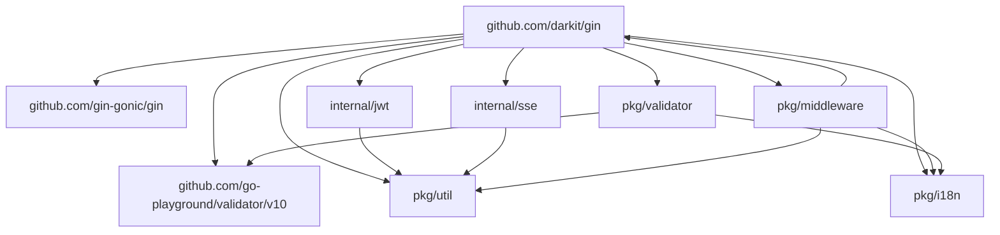

# 项目结构说明

## 目录
- [1. 项目概述](#1-项目概述)
- [2. 目录结构](#2-目录结构)
- [3. 模块划分](#3-模块划分)
- [4. 核心包详解](#4-核心包详解)
- [5. 关键文件说明](#5-关键文件说明)
- [6. 依赖关系](#6-依赖关系)
- [7. 扩展与定制](#7-扩展与定制)

## 1. 项目概述

Gin扩展框架是一个基于Go官方Gin框架的增强版Web开发框架，专注于提供更便捷的API开发体验和更丰富的Web功能。框架保持了Gin的高性能特性，同时通过扩展Context和增强功能，大幅简化了常见Web开发任务。

本项目采用模块化设计，遵循简洁清晰的代码组织结构，便于理解和扩展。项目主要关注Web请求处理层，不涉及具体业务逻辑和数据持久化实现。

## 2. 目录结构

```
github.com/darkit/gin/
├── cmd/                  # 命令行工具和示例应用入口
├── examples/             # 使用示例代码
│   ├── main.go           # 示例应用主入口
│   └── templates/        # 示例HTML模板
├── pkg/                  # 公共包
│   ├── middleware/       # 中间件实现
│   ├── validator/        # 数据验证工具
│   ├── util/             # 通用工具函数
│   └── i18n/             # 国际化支持
├── internal/             # 内部包（不导出）
│   ├── mock/             # 测试模拟对象
│   ├── jwt/              # JWT实现
│   └── sse/              # SSE内部实现
├── docs/                 # 文档
├── context.go            # 核心Context扩展
├── handler.go            # 处理器工具函数
├── router.go             # 路由扩展
├── server.go             # 服务器实现
├── sse.go                # SSE服务器实现
├── go.mod                # Go模块定义
├── go.sum                # 依赖校验和
├── LICENSE               # 许可证
├── README.md             # 项目说明
└── Makefile              # 构建脚本
```

## 3. 模块划分

框架的核心功能按照以下模块进行划分：

### 3.1 核心扩展模块

- **Context扩展**：扩展原生Gin上下文，提供统一的响应格式和便捷方法
- **Router扩展**：增强原生路由器，支持更灵活的路由注册和分组
- **Server实现**：封装HTTP服务器的启动、配置和优雅关闭

### 3.2 功能模块

- **认证授权**：JWT认证实现，支持令牌创建、验证和刷新
- **数据验证**：基于标签和自定义验证的数据验证系统
- **中间件**：常用中间件集合，如CORS、日志、恢复等
- **SSE服务**：服务器发送事件(SSE)实现，支持实时推送
- **国际化**：多语言支持，便于应用国际化
- **安全增强**：安全相关的HTTP头设置和防护措施

### 3.3 工具模块

- **参数处理**：简化的请求参数获取和类型转换
- **文件上传**：文件上传处理和验证
- **URL构建**：便捷的URL生成工具
- **序列化**：JSON、XML等数据格式的序列化和反序列化

## 4. 核心包详解

### 4.1 主包 (github.com/darkit/gin)

主包包含框架的核心组件和API，这些组件直接导出供用户使用。

**关键类型和接口**：
- `Context`：扩展的Gin上下文，提供额外功能
- `Router`：扩展的路由器，用于注册路由和中间件
- `Server`：HTTP服务器，负责应用启动和关闭
- `SSEServer`：SSE服务器，处理事件推送
- `Response`：统一响应结构

### 4.2 中间件包 (github.com/darkit/gin/pkg/middleware)

中间件包提供可重用的中间件组件，用于请求处理流水线。

**主要中间件**：
- `Recovery`：从panic中恢复并返回500错误
- `Logger`：请求日志记录
- `CORS`：跨域资源共享支持
- `RateLimiter`：请求频率限制
- `Timeout`：请求超时控制
- `SecurityHeaders`：安全相关HTTP头设置
- `I18n`：国际化中间件

### 4.3 验证器包 (github.com/darkit/gin/pkg/validator)

验证器包提供数据验证工具，用于验证请求参数和请求体。

**主要组件**：
- `Validator`接口：自定义验证器接口
- 内置验证规则：常用数据验证规则
- 验证错误处理：统一的错误格式和国际化支持

### 4.4 工具包 (github.com/darkit/gin/pkg/util)

工具包提供各种辅助函数和工具。

**主要工具**：
- 字符串处理工具
- 时间处理工具
- 加密和哈希工具
- UUID生成
- 分页工具

### 4.5 国际化包 (github.com/darkit/gin/pkg/i18n)

国际化包提供多语言支持功能。

**主要组件**：
- 翻译管理
- 语言检测
- 消息格式化

## 5. 关键文件说明

### 5.1 context.go

包含Context结构体的定义和实现，是框架的核心部分。扩展了原生gin.Context，提供了更便捷的API调用方式和统一的响应格式。

**主要功能**：
- 统一的JSON响应方法（Success/Fail/Error）
- 简化的参数获取和验证（Param/ParamInt/RequireParams）
- JWT会话管理（CreateJWTSession/RequireJWT）
- 文件上传处理（SaveUploadedFile）
- 安全相关设置（SetSecureHeaders）

### 5.2 router.go

包含Router结构体的定义和实现，扩展了原生gin.Engine，提供更丰富的路由注册方式。

**主要功能**：
- 增强的路由组功能
- 链式API设计
- 静态文件服务优化
- 路由注册辅助方法

### 5.3 server.go

包含Server结构体的定义和实现，封装了HTTP服务器的创建、配置和生命周期管理。

**主要功能**：
- 服务器配置管理
- 优雅启动和关闭
- TLS支持
- 服务器状态监控

### 5.4 sse.go

包含SSE（Server-Sent Events）相关的实现，支持服务器到客户端的实时事件推送。

**主要功能**：
- SSE服务器和客户端管理
- 事件广播和定向发送
- 连接保活和断线重连支持
- 客户端分组和过滤

### 5.5 handler.go

包含通用的处理器辅助函数和工具方法，简化控制器开发。

**主要功能**：
- 常见请求处理模式
- 错误处理辅助函数
- 分页响应生成
- 数据绑定和验证辅助

## 6. 依赖关系

框架的核心依赖关系如下：



- `github.com/gin-gonic/gin`：基础框架依赖，框架基于Gin构建
- `github.com/go-playground/validator/v10`：数据验证库，用于请求参数和请求体验证
- 内部包和公共包：框架自身的功能模块，相互协作提供完整功能

## 7. 扩展与定制

框架设计为高度可扩展，提供了多种扩展点和定制方式：

### 7.1 中间件扩展

用户可以通过实现标准的Gin中间件函数，来扩展请求处理流水线：

```go
func CustomMiddleware() gin.HandlerFunc {
    return func(c *gin.Context) {
        // 前置处理
        c.Next()
        // 后置处理
    }
}

// 使用中间件
router.Use(CustomMiddleware())
```

### 7.2 验证器扩展

通过实现Validator接口，可以添加自定义的数据验证规则：

```go
type CustomValidator struct {
    // 验证所需的字段
}

// 实现Validator接口
func (v *CustomValidator) Validate() (bool, string) {
    // 自定义验证逻辑
    return true, ""
}

// 使用自定义验证器
if !c.Validate(&CustomValidator{}) {
    return
}
```

### 7.3 响应格式定制

可以通过设置全局响应处理函数，来定制统一的响应格式：

```go
// 设置自定义响应格式化函数
gin.SetResponseFormatter(func(code int, message string, data interface{}) gin.H {
    return gin.H{
        "status": code == 0 ? "success" : "error",
        "code": code,
        "message": message,
        "result": data,
        "timestamp": time.Now().Unix(),
    }
})
```

### 7.4 国际化定制

可以注册自定义的翻译文件和本地化策略：

```go
// 注册翻译文件
i18n.LoadTranslations("./locales")

// 设置语言检测策略
i18n.SetLocaleDetector(func(c *gin.Context) string {
    return c.GetHeader("Accept-Language")
})
```

### 7.5 功能模块替换

框架的核心组件都设计为可替换的，可以通过自定义实现来替换默认行为：

```go
// 替换默认的JWT处理器
gin.SetJWTProvider(&CustomJWTProvider{})

// 替换默认的文件上传处理器
gin.SetFileUploadHandler(&CustomFileHandler{})
```

通过这些扩展点和定制方式，用户可以在保持框架核心功能的同时，根据自己的需求定制框架行为。 