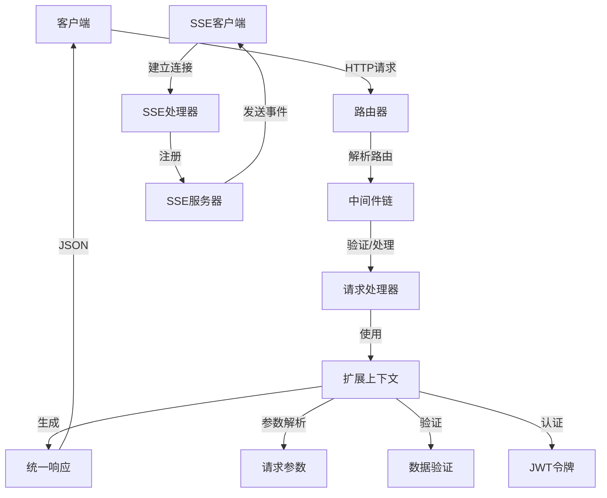

# 领域模型说明

## 目录
- [1. 领域模型概述](#1-领域模型概述)
- [2. 核心实体关系图](#2-核心实体关系图)
- [3. 核心实体说明](#3-核心实体说明)
- [4. 模型交互](#4-模型交互)
- [5. 数据流转关系](#5-数据流转关系)
- [6. 业务场景分析](#6-业务场景分析)

## 1. 领域模型概述

Gin扩展框架的领域模型主要围绕Web请求处理和响应流程展开，通过对标准Gin框架进行增强，提供更加便捷和强大的API开发体验。核心领域概念包括上下文扩展、请求处理、响应格式化、认证授权、数据验证和安全增强等。

### 领域边界

本框架专注于Web应用开发中的请求处理层，不涉及具体的业务逻辑实现和数据持久化方案。其领域边界主要包括：

- HTTP请求接收与处理
- 参数解析与验证
- 认证与授权
- 响应生成与格式化
- 会话与状态管理
- 安全增强措施
- 国际化支持
- 事件流处理

## 2. 核心实体关系图

```mermaid
classDiagram
    class Context {
        +gin.Context *original
        +Success(data interface{})
        +SuccessWithMsg(message string, data interface{})
        +Fail(message string)
        +Error(message string)
        +GetParams() map[string]interface{}
        +Param(key string) string
        +ParamInt(key string, defaultValue int) int
        +RequireParams(keys ...string) bool
        +GetToken() string
        +SetSecureHeaders()
        +CreateJWTSession(secret string, duration time.Duration, claims map[string]interface{}) (string, error)
        +RequireJWT(secret string) (map[string]interface{}, bool)
    }
    
    class Response {
        +Code int
        +Message string
        +Data interface{}
        +Timestamp int64
        +RequestID string
    }
    
    class Router {
        +gin.Engine *original
        +Group(path string, handlers ...gin.HandlerFunc) *RouterGroup
        +Use(middlewares ...gin.HandlerFunc)
        +GET(path string, handlers ...gin.HandlerFunc)
        +POST(path string, handlers ...gin.HandlerFunc)
        +PUT(path string, handlers ...gin.HandlerFunc)
        +DELETE(path string, handlers ...gin.HandlerFunc)
    }
    
    class RouterGroup {
        +gin.RouterGroup *original
        +Group(path string, handlers ...gin.HandlerFunc) *RouterGroup
        +Use(middlewares ...gin.HandlerFunc)
        +GET(path string, handlers ...gin.HandlerFunc)
        +POST(path string, handlers ...gin.HandlerFunc)
        +PUT(path string, handlers ...gin.HandlerFunc)
        +DELETE(path string, handlers ...gin.HandlerFunc)
    }
    
    class Server {
        +Router *Router
        +Config ServerConfig
        +Run() error
        +Shutdown(ctx context.Context) error
    }
    
    class ServerConfig {
        +Port int
        +ReadTimeout time.Duration
        +WriteTimeout time.Duration
        +MaxHeaderBytes int
        +TrustedProxies []string
    }
    
    class JWT {
        +Create(secret string, duration time.Duration, claims map[string]interface{}) (string, error)
        +Verify(token string, secret string) (map[string]interface{}, error)
        +Refresh(token string, secret string, duration time.Duration) (string, error)
    }
    
    class Validator {
        +Validate() (bool, string)
    }
    
    class SSEServer {
        +Clients map[string]*SSEClient
        +Broadcast(event string, data interface{})
        +AddClient(client *SSEClient)
        +RemoveClient(clientID string)
    }
    
    class SSEClient {
        +ID string
        +Connection *gin.Context
        +Send(event string, data interface{})
        +Close()
    }
    
    Router "1" *-- "*" RouterGroup : 包含
    Server "1" *-- "1" Router : 包含
    Context "1" *-- "1" Response : 生成
    Context ..> JWT : 使用
    Context ..> Validator : 使用
    Router ..> Context : 创建
    SSEServer "1" *-- "*" SSEClient : 管理
    Context ..> SSEServer : 使用
```

## 3. 核心实体说明

### Context 扩展上下文

| 属性/方法 | 类型 | 说明 |
|---------|------|------|
| original | *gin.Context | 原始的Gin上下文对象 |
| Success | 方法 | 返回成功响应，仅包含数据 |
| SuccessWithMsg | 方法 | 返回成功响应，包含消息和数据 |
| Fail | 方法 | 返回业务失败响应 |
| Error | 方法 | 返回错误响应 |
| GetParams | 方法 | 获取所有请求参数的映射 |
| Param | 方法 | 获取字符串类型参数 |
| ParamInt | 方法 | 获取整数类型参数，带默认值 |
| RequireParams | 方法 | 验证必需参数是否存在 |
| GetToken | 方法 | 从请求中提取认证令牌 |
| SetSecureHeaders | 方法 | 设置安全相关的HTTP头 |
| CreateJWTSession | 方法 | 创建JWT会话令牌 |
| RequireJWT | 方法 | 验证并提取JWT令牌中的信息 |

#### 业务规则
- 响应格式必须遵循统一的结构（Code, Message, Data, Timestamp, RequestID）
- JWT令牌验证失败时，自动返回401响应
- 必需参数验证失败时，自动返回400响应
- 文件上传需验证文件类型和大小是否符合配置要求

### Response 统一响应

| 属性 | 类型 | 说明 |
|-----|------|------|
| Code | int | 响应状态码，0表示成功，其他表示特定错误类型 |
| Message | string | 响应消息，成功或错误描述 |
| Data | interface{} | 响应数据，可为任意类型 |
| Timestamp | int64 | 响应生成时间戳 |
| RequestID | string | 请求唯一标识符 |

#### 业务规则
- 成功响应必须设置Code为0
- 业务失败响应的Code应在1000-9999范围内
- 系统错误响应的Code应为负数
- Timestamp必须使用Unix时间戳（秒级）
- RequestID应当在整个请求链路中保持一致

### Router 扩展路由器

| 属性/方法 | 类型 | 说明 |
|---------|------|------|
| original | *gin.Engine | 原始的Gin引擎对象 |
| Group | 方法 | 创建路由组 |
| Use | 方法 | 添加全局中间件 |
| GET/POST/PUT/DELETE | 方法 | HTTP请求方法路由注册 |

#### 业务规则
- 路由注册必须按照RESTful API规范设计
- 路由处理函数必须使用扩展的Context，而非原生gin.Context
- 中间件的执行顺序与注册顺序保持一致

### Server 服务器

| 属性/方法 | 类型 | 说明 |
|---------|------|------|
| Router | *Router | 服务器使用的路由器 |
| Config | ServerConfig | 服务器配置 |
| Run | 方法 | 启动HTTP服务器 |
| Shutdown | 方法 | 优雅关闭服务器 |

#### 业务规则
- 服务器必须支持优雅启动和关闭
- 配置中的超时设置必须合理，避免长时间阻塞
- 服务器启动失败必须提供明确的错误信息

### JWT 认证

| 方法 | 说明 |
|-----|------|
| Create | 创建JWT令牌 |
| Verify | 验证JWT令牌 |
| Refresh | 刷新JWT令牌 |

#### 业务规则
- JWT必须包含过期时间（exp）声明
- 密钥必须有足够的长度和复杂度
- 令牌刷新操作必须验证原令牌的有效性

### SSEServer 服务器发送事件

| 属性/方法 | 类型 | 说明 |
|---------|------|------|
| Clients | map[string]*SSEClient | 当前连接的客户端映射 |
| Broadcast | 方法 | 向所有客户端广播事件 |
| AddClient | 方法 | 添加新客户端连接 |
| RemoveClient | 方法 | 移除客户端连接 |

#### 业务规则
- 客户端连接必须具有唯一标识符
- 事件名称和数据必须符合SSE规范
- 长时间空闲的连接应定期发送心跳包或自动断开

## 4. 模型交互

### HTTP请求处理流程

1. 客户端发送HTTP请求
2. Router接收请求并匹配路由
3. 执行注册的中间件链
4. 将gin.Context包装为扩展的Context
5. 执行路由处理函数
6. Context生成统一格式的Response
7. 将Response序列化为JSON并返回

### JWT认证流程

1. 用户登录请求提供凭证
2. 验证凭证后，Context调用CreateJWTSession创建令牌
3. 返回令牌给客户端
4. 后续请求中，客户端在Header中附加令牌
5. 服务器通过Context.RequireJWT验证令牌
6. 验证成功后，继续执行业务逻辑

### 事件流（SSE）处理流程

1. 客户端发起SSE连接请求
2. 服务器创建SSEClient并添加到SSEServer
3. SSEServer保持连接开放
4. 当有事件发生时，SSEServer广播或定向发送事件
5. 客户端断开连接时，SSEServer移除对应的SSEClient

## 5. 数据流转关系



## 6. 业务场景分析

### 用户认证与授权场景

在需要身份验证的API中，框架通过JWT实现无状态的用户认证机制：

1. **登录流程**：
   - 客户端提交用户名/密码
   - 服务端验证凭证
   - 调用`Context.CreateJWTSession`生成JWT令牌
   - 返回令牌给客户端

2. **受保护资源访问**：
   - 客户端请求头中携带JWT令牌
   - 中间件调用`Context.RequireJWT`验证令牌
   - 验证失败直接返回401响应
   - 验证成功继续处理请求，可从令牌中提取用户信息

### 实时通知场景

使用SSE机制实现服务器到客户端的实时通知：

1. **建立连接**：
   - 客户端发起SSE连接请求
   - 服务端创建SSEClient并注册到SSEServer
   - 保持连接开放

2. **事件推送**：
   - 当系统状态变化时（如新消息、数据更新）
   - SSEServer.Broadcast广播事件给所有客户端
   - 或SSEClient.Send定向发送给特定客户端

3. **连接管理**：
   - 检测断开连接并清理资源
   - 定期发送心跳保持连接活跃
   - 限制单用户连接数量避免资源耗尽 