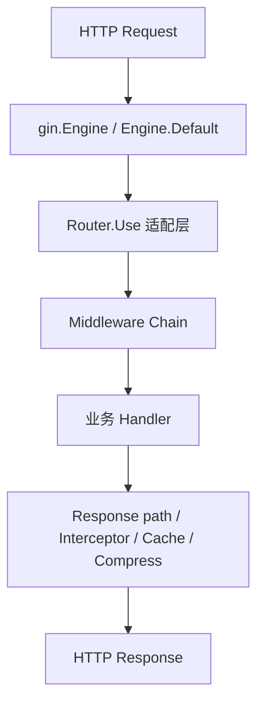
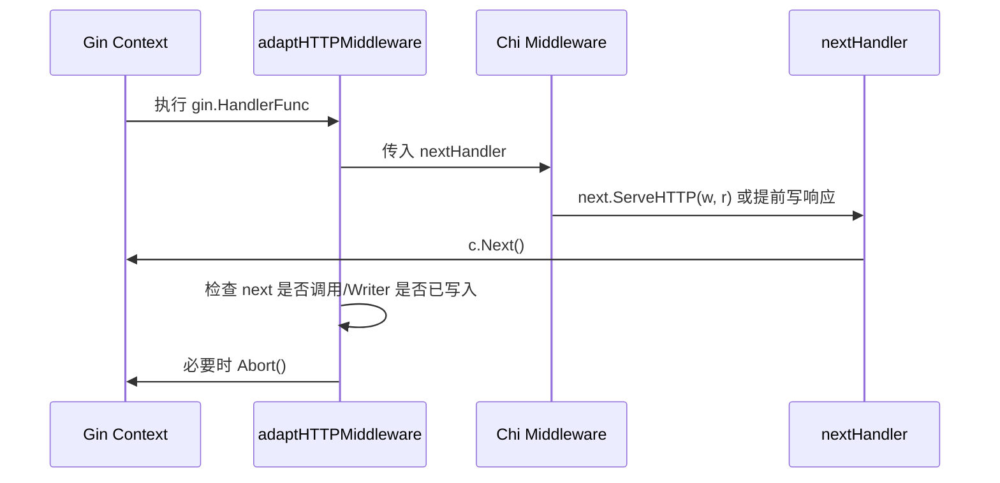

# middleware 设计说明

`middleware/` 模块承担框架请求处理链中的横切逻辑：请求标识、异常恢复、日志、安全控制、性能优化、业务幂等，以及 Chi 风格 middleware 兼容。

本文基于当前实现说明中间件链路结构、适配模式、注册表设计、执行顺序与错误处理策略。

---

## 1. 设计目标

### 目标

1. 为 Gin 应用提供开箱即用的核心中间件链
2. 让安全、性能、业务控制以组合方式接入路由
3. 兼容原生 Gin middleware、增强型 handler 与 Chi 风格 HTTP middleware
4. 通过注册表支持中间件的集中启停与排序
5. 对 panic、超时、签名失败、限流失败等场景给出稳定响应

### 非目标

1. 不实现跨进程统一 middleware 编排中心
2. 不强制所有中间件接入 `Registry`
3. 不替代服务器级网络超时、连接池、反向代理治理能力
4. 不对所有第三方 Chi middleware 提供完全语义等价保证

---

## 2. Middleware chain architecture

### 2.1 运行时层次

中间件体系分成 4 层：



### 2.2 默认链

`engine.go` 的 `Default()` 会直接向底层 `gin.Engine` 注册：

```go
middleware.RequestID()
middleware.Recovery()
middleware.Logger()
```

这条默认链有两个特征：

- **简单确定**：开箱即用，避免用户忘记注入基础保护层
- **职责分明**：先补齐追踪信息，再兜底 panic，最后记录请求结果

### 2.3 扩展链

业务侧通常通过以下方式叠加扩展中间件：

- `e.Use(...)` / `r.Use(...)` 注入 Gin middleware
- 路由组 `Group(...).Use(...)` 局部挂载
- 通过 `Registry.GetChain()` 批量装配
- 使用 `Interceptor()` 对请求与响应做双向切面处理

### 2.4 请求-响应双向链

并非所有中间件都只工作在请求前半段：

- `RequestID`：请求进入时设置 ID，响应返回时已可复用该值
- `Logger`：`c.Next()` 后读取状态码与耗时
- `Cache`：请求进入时查缓存；响应结束后写缓存
- `Compress`：包装 `ResponseWriter`，在响应写出阶段决定是否压缩
- `Interceptor`：先执行 `OnRequest`，再在 `c.Next()` 完成后处理响应体

因此整体设计不是单向前置过滤，而是典型的 **around middleware chain**。

---

## 3. Adapter pattern for different middleware types

### 3.1 适配目标

框架需要统一处理 4 类 middleware / handler：

| 类型 | 入口 | 说明 |
| --- | --- | --- |
| 增强型 `HandlerFunc` | `Router.Use()` / 路由注册 | 使用框架包装后的 `*Context` |
| `func(*Context)` 字面量 | `Router.Use()` | 增强上下文写法 |
| 原生 `gin.HandlerFunc` | `Router.Use()` / `Engine.Use()` | Gin 与第三方生态标准形式 |
| `func(http.Handler) http.Handler` | `Router.Use()` | Chi / 标准 HTTP middleware |

### 3.2 Router.Use 适配分发

`router.go` 的 `Router.Use()` 在运行时通过类型分支做适配：

- `HandlerFunc` → `wrapHandler(...)`
- `func(*Context)` → 先转 `HandlerFunc` 再包装
- `gin.HandlerFunc` / `func(*gin.Context)` → 直接使用
- `func(http.Handler) http.Handler` → 交给 `adaptHTTPMiddleware(...)`

此设计的关键收益：

1. **调用端无感知**：用户不必手动转换类型
2. **组合自由**：同一 `Use()` 可混挂多种 middleware 形态
3. **兼容存量资产**：Gin 与 Chi 生态可共存

### 3.3 Chi middleware adapter

`adaptHTTPMiddleware()` 是不同链模型之间的桥。

Chi middleware 模型：

```go
func(next http.Handler) http.Handler
```

Gin middleware 模型：

```go
func(c *gin.Context)
```

适配器核心步骤：



适配逻辑包含两项防御：

1. **nextCalled 检测**：若 Chi middleware 未调用 `next.ServeHTTP`，则视为主动截断，自动 `Abort()`
2. **Written 状态检测**：若 middleware 已写响应，则不允许 Gin 再继续写出，避免双写

### 3.4 gin_compat.go 的角色

`gin_compat.go` 本身不做适配执行，但导出了：

- 原生 Gin 类型别名
- `GinHandlerFunc`
- `HTTPMiddleware = func(http.Handler) http.Handler`

因此它承担的是 **兼容类型层**，而真正的执行适配发生在 `router.go`。

---

## 4. Registry system design

### 4.1 数据结构

`registry.go` 中的注册表核心结构：

```go
type Middleware struct {
    Name        string
    Description string
    Factory     func() gin.HandlerFunc
    Order       int
    Enabled     bool
}

type Registry struct {
    mu          sync.RWMutex
    middlewares map[string]*Middleware
}
```

### 4.2 设计动机

注册表解决的是 **中间件元信息管理**，不是直接替代 `Use()`：

- 按名称查找 middleware
- 启用/禁用 middleware
- 根据 `Order` 生成确定顺序链
- 延迟通过 `Factory()` 构建实际 handler

这使得 middleware 配置具备更高的声明式特征。

### 4.3 内建注册项

`registerBuiltin()` 默认注册：

| Name | Order | Enabled | Factory |
| --- | ---: | --- | --- |
| `recovery` | 0 | true | `Recovery` |
| `request_id` | 10 | true | `RequestID` |
| `logger` | 20 | true | `Logger` |
| `cors` | 30 | false | `CORS()` |
| `ratelimit` | 40 | false | `RateLimit()` |
| `timeout` | 50 | false | `Timeout(30s)` |
| `secure` | 60 | false | `Secure` |
| `circuit_breaker` | 70 | false | `CircuitBreaker()` |

### 4.4 生命周期

```mermaid
flowchart LR
    A[NewRegistry] --> B[registerBuiltin]
    B --> C[Register / Enable / Disable]
    C --> D[Get(name)]
    C --> E[GetChain() 按 Order 排序]
    E --> F[批量挂载到 Router / Engine]
```

### 4.5 并发安全

注册表使用 `sync.RWMutex`：

- `Register` / `Enable` / `Disable`：写锁
- `Get` / `GetChain`：读锁

同时在 `Get()` / `GetChain()` 中复制结构体，减少外部对内部状态的意外修改风险。

### 4.6 当前限制

1. `Engine.Default()` 的默认链与 `Registry` 是并行存在的两套入口
2. `Registry` 当前未自动驱动 `Engine` 启动链
3. 带参数 middleware 的 `Factory` 多使用固定默认值，复杂配置仍需业务侧自行注册

这意味着 `Registry` 当前更接近 **可选的 middleware catalog**，而不是唯一编排中心。

---

## 5. Execution order and priorities

### 5.1 顺序原则

当前实现体现出的推荐顺序是：

1. **Request identity / trace**：`RequestID`
2. **Crash protection**：`Recovery`
3. **Observability**：`Logger`
4. **Early rejection security**：`SignatureVerify`、`RateLimit`
5. **Response policy**：`CORS`、`Secure`、`NoCache`、`Sunset`
6. **Performance wrappers**：`Cache`、`Compress`、`Timeout`
7. **Business control**：`Idempotent`
8. **Route-specific decisions**：`RouteHeaders`、`ValidateParam`、`Maybe`
9. **Handler**

### 5.2 默认顺序与 Registry 顺序的差异

存在一个实现细节：

- `Engine.Default()` 中默认调用顺序：`RequestID -> Recovery -> Logger`
- `Registry` 内建顺序：`Recovery -> RequestID -> Logger`

两者都能工作，但语义略有差别：

- 若 `RequestID` 更早执行，可让 `Recovery` / `Logger` 更容易拿到追踪 ID
- 若 `Recovery` 最先执行，可最大范围兜住后续 middleware panic

从工程角度看，两者都合理；若未来统一编排入口，建议明确单一顺序规范。

### 5.3 典型生产顺序

建议业务侧采用：

```text
RequestID
→ Recovery
→ Logger
→ SignatureVerify / RateLimit / Throttle
→ CORS / Secure / NoCache / Sunset
→ Timeout
→ Cache / Compress
→ Idempotent
→ ValidateParam / RouteHeaders / Maybe
→ Handler
```

### 5.4 为什么 Timeout 不放最前

`Timeout` 会把 `c.Next()` 放到 goroutine 中执行，并接管完成/超时协调。若放得过前：

- 更容易扩大并发复杂度
- 对部分只需快速拒绝的安全 middleware 不划算
- 可能增加调试复杂度

因此更适合作为 **业务处理保护层**，而不是最外层公共卫兵。

---

## 6. Error handling in middleware chain

### 6.1 总体原则

模块中的错误处理有 4 类：

1. **直接拒绝并返回固定 HTTP 状态码**
2. **写 JSON 错误响应并 `Abort()`**
3. **捕获异常/超时后兜底返回**
4. **记录错误但避免双写响应**

### 6.2 Panic handling

`Recovery()` / `RecoveryWithWriter()`：

- 用 `defer recover()` 兜底 panic
- 遇到 `broken pipe` / `connection reset` 时，不再尝试写 500 body，只记录错误并 `Abort()`
- 其他 panic 统一 `AbortWithStatus(500)`

这是整个 middleware chain 的最后防线。

### 6.3 Validation and security failure handling

#### SignatureVerify

失败即中止，典型返回：

- `401 Unauthorized`：缺少头、时间戳非法、签名无效、nonce 重放
- `413 Request Entity Too Large`：body 超限
- `500 Internal Server Error`：读 body / 写 nonce store 失败

#### ValidateParam

参数不匹配正则时：

- 返回 `400`
- 输出 JSON：`error`、`param`、`value`、`format`
- 调用 `Abort()` 阻断后续 handler

#### RateLimit / Throttle

- `RateLimit`：简单返回 `429`
- `Throttle`：根据场景返回容量超限、等待超时或 context canceled，且可选 `Retry-After`

### 6.4 Timeout handling

`Timeout(d)` 的设计重点在于 **只在未写响应时兜底写超时状态**：

- 正常完成：若已超时但尚未写响应，返回 `408`
- 超时分支：等待 handler goroutine 完成后，再决定是否写 `408`
- 若 handler 已写响应，则不再覆盖
- 若 goroutine 内发生 panic，则重新抛出给外层 `Recovery`

这避免了最常见的两个问题：

1. handler 与 timeout 分支重复写响应
2. panic 被超时逻辑吞掉

### 6.5 Response post-processing failure

#### Interceptor

- `OnRequest` 返回错误 → `400` + `{"error": ...}` + `Abort()`
- `OnResponse` 返回错误 → 恢复原始 writer，返回 `500` + `{"error":"响应处理失败"}`

#### Cache

- 读缓存失败：视为 miss，继续链路
- 反序列化失败：视为 miss，继续链路
- 写缓存失败：静默忽略，不影响主请求成功响应

#### Compress

- 初始化压缩器失败：退化为原始响应直写
- 已存在 `Content-Encoding`：不再重复压缩

整体策略是：**后处理优化失败，不应影响主业务正确性**。

### 6.6 Idempotent handling

`Idempotent()` 侧重“命中时重放，异常时不扩散”：

- 命中缓存 → 直接写缓存状态码与 body，`Abort()`
- 写入 store 失败 → 静默忽略，不回滚当前请求
- 若中间链已 `Abort()` → 不再缓存本次响应

这保证了幂等控制不会反向成为业务可用性瓶颈。

---

## 7. 关键中间件设计要点

### 7.1 RequestID

- 输入：`X-Request-ID`
- 回退：自动生成 UUID
- 输出：header + context key
- 价值：为后续日志、错误、响应包装提供追踪基线

### 7.2 Cache

- 仅缓存 `GET` / `HEAD`
- 使用包装 `ResponseWriter` 捕获 body/status
- 通过 `gob` 序列化完整响应快照
- 设计目标是 **命中优先、失败降级**

### 7.3 Compress

- 延迟决策压缩：先缓冲部分 body，再判断 MIME 与长度
- 根据 `Accept-Encoding` 与服务端优先级选算法
- 通过 `compressWriter` 实现 `Write`、`Flush`、`Hijack` 兼容

### 7.4 Idempotent

- 默认 key 源于 `Idempotency-Key`
- Store 支持 TTL
- 内存存储采用 32 分片减少锁竞争
- 适合写接口结果重放，不适合长时间历史审计

### 7.5 SignatureVerify

- 将 timestamp、nonce、method、path、body、附加 header 拼接验签
- 内存 `NonceStore` 周期清理过期条目
- 面向安全优先场景，允许通过 Option 自定义算法、时效、body 上限

---

## 8. Chi support design

### 8.1 两种支持方式

当前模块对 Chi 生态支持分两类：

1. **桥接型支持**：直接接收 Chi middleware，通过 `adaptHTTPMiddleware()` 运行
2. **移植型支持**：将 Chi 常见设计翻译为 Gin middleware，如 `Throttle`、`RealIP`、`Sunset`

### 8.2 这样设计的原因

纯桥接并不能覆盖所有语义差异：

- Chi middleware 基于 `http.Handler`
- Gin middleware 基于 `Context` 与 `Next/Abort`
- 部分链路控制、响应写出时机、上下文共享模型并不完全一致

所以模块采用“双轨设计”：

- 能桥接的桥接
- 需要更强控制的直接实现 Gin 原生版本

这也是 `middleware/` 目录中同时存在 `Throttle`、`RealIP`、`NoCache` 等实现的根本原因。

---

## 9. 设计取舍

### 9.1 选择运行时适配，而非泛型/统一接口

优点：

- 调用体验简单
- 兼容历史代码
- 不强制用户迁移现有 middleware

代价：

- 类型分支在运行时做
- 错误类型要到执行阶段才暴露（不支持的 middleware 会 panic）

### 9.2 选择内存默认存储

`Cache`、`Idempotent`、`SignatureVerify` 默认都提供内存实现。

优点：

- 零配置可用
- 便于测试
- 启动简单

代价：

- 多实例部署下不共享状态
- 生命周期与进程绑定
- 需要业务侧显式切换到外部存储

### 9.3 选择 middleware 自行兜底，而非统一错误框架

优点：

- 每个中间件能给出最契合的错误语义
- 逻辑内聚

代价：

- 错误返回格式不完全一致
- 若业务方要求统一错误包络，需在更外层再封装

---

## 10. 演进建议

1. **统一默认链顺序**：对齐 `Engine.Default()` 与 `Registry` 的顺序定义
2. **Registry 深度集成**：允许 `Engine` 直接从 `Registry` 自动装载链
3. **统一错误响应协议**：为安全/校验/限流类中间件提供可配置错误写出器
4. **分布式存储扩展**：为 `IdempotentStore`、`NonceStore` 提供 Redis 官方实现
5. **更细的优先级模型**：用枚举或阶段标签替代裸 `Order` 整数
6. **文档与示例联动**：增加生产推荐链的端到端 example

---

## 11. 结论

`middleware/` 的核心设计不是“中间件集合”这么简单，而是一个兼具：

- 默认核心保护链
- 多类型 middleware 适配桥
- 可声明式管理的注册表
- 可扩展的请求/响应拦截模型
- Chi 生态复用入口

的横切能力层。

其当前设计重点在 **兼容性、可组合性、失败降级**。这使它既能作为基础设施层稳定运行，也能承载业务侧的安全、性能与链路治理策略。